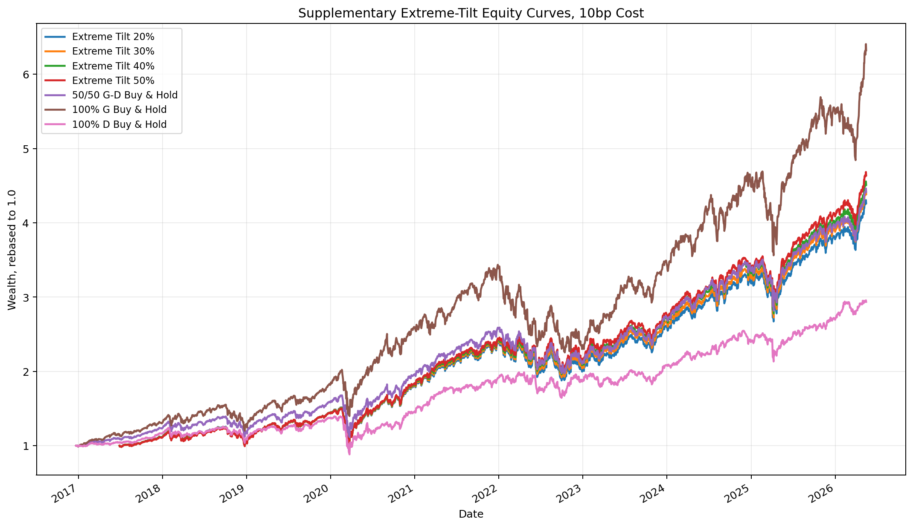
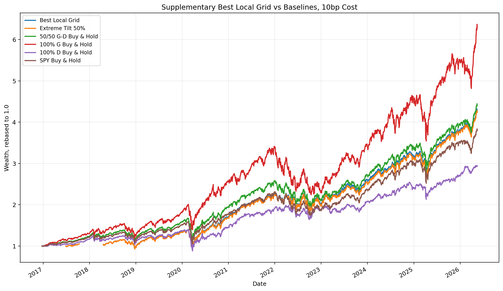
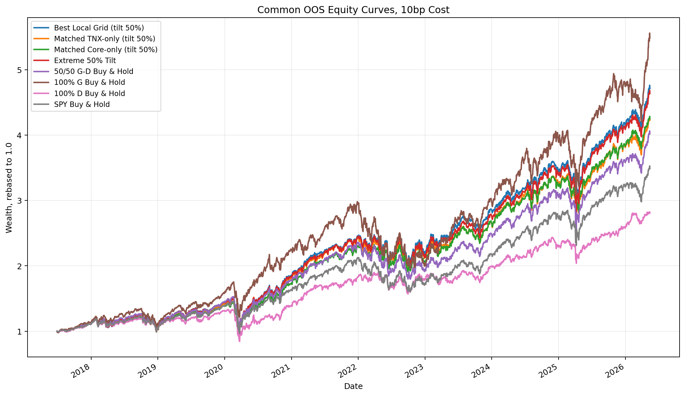
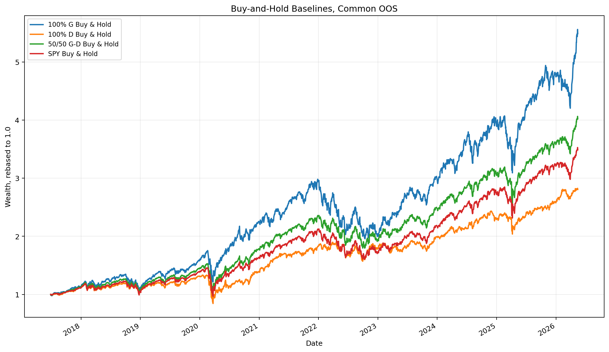
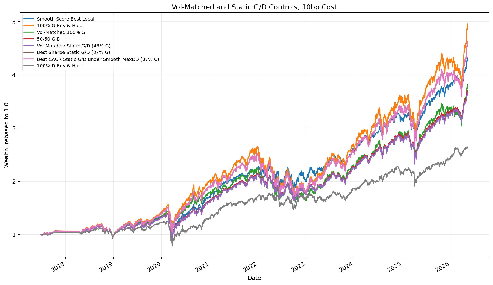
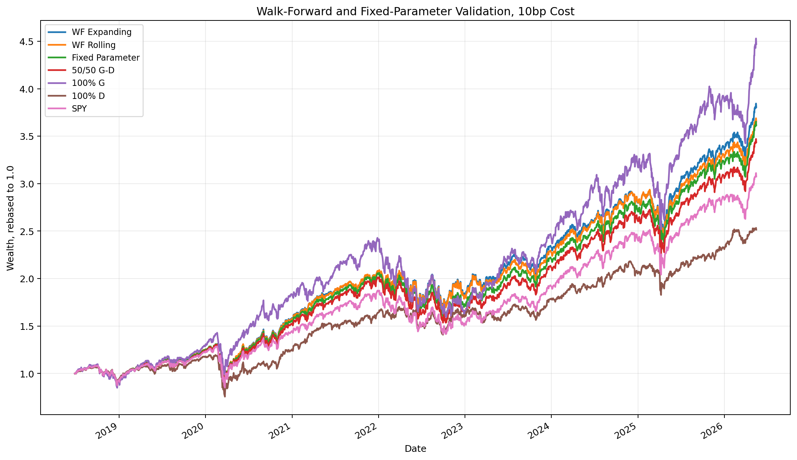
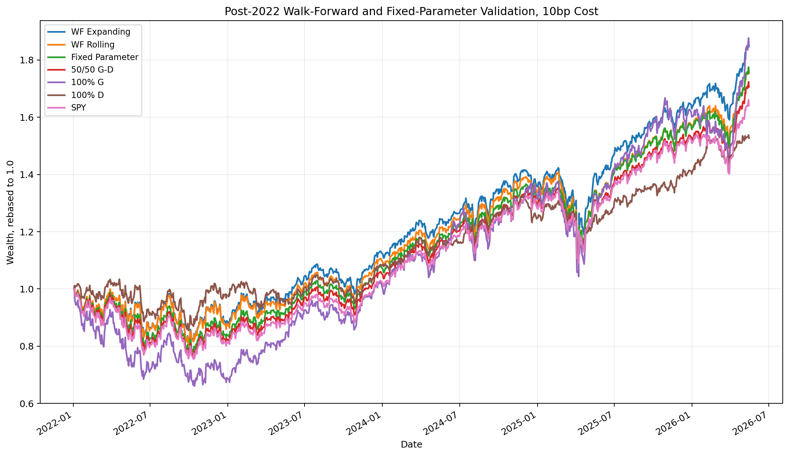

# Phase 1 2016 Full Archive Combined Report

Report date: 2026-05-20  
Repository scope: reproducible research archive, not a manuscript or paper.

## 0. Archive Scope

This archive keeps the final Phase 1 research chain requested for the 2016-start record. It includes two retained modules:

1. **Factor attribution**: Fama-French 5 Factors plus Momentum regressions for the growth/technology basket `G`, the defensive income basket `D`, and the long-short relative portfolio `G-D`.
2. **Smooth Continuous Score Policy v1**: the complete smooth-score allocation process, including the main grid, buy-and-hold benchmarks, vol-matched comparisons, supplementary tilt tests, expanded local grid, walk-forward validation, fixed-parameter validation, equity curves, yearly metrics, and artifact date-range lineage.

The archive deliberately excludes older exploratory branches:

- old state sorting;
- old predictive regression;
- old standalone OOS validation;
- old state-action policy experiments;
- all ElasticNet experiments.

The goal is to preserve one clean research path from raw 2016-start data to the final Phase 1 empirical report.

## 1. Data Start and Natural Warmup

- The common `G/D` source return sample starts on `2016-12-21`.
- The factor-attribution regression sample runs from `2016-12-21` to `2026-03-31`.
- The smooth-score source sample also starts from the common `G/D` source date, `2016-12-21`.
- Dynamic smooth-score policies require `G-D trailing 126d`, so the fully formed smooth-score trading series starts after the natural 126-trading-day warmup. This is a feature-definition warmup, not a discretionary mid-sample cut.
- The main aligned smooth-score comparison window is `2017-06-28` to `2026-05-15`.
- The OOS validation window is `2018-06-28` to `2026-05-15`.
- The post-2022 robustness window is `2022-01-03` to `2026-05-15`.

## 2. Research Chain and Output Lineage

The retained lineage is documented in:

`data/phase1/archive_2016_full/tables/phase1_2016_full_archive_lineage.csv`

| step | archive_status | sample_note |
| --- | --- | --- |
| `1_factor_attribution` | included | FF5+MOM regression sample starts on `2016-12-21`. |
| `2_smooth_score_policy_v1` | included | `G/D` source returns start on `2016-12-21`; the dynamic policy uses the natural 126-day trailing warmup. |
| `excluded_old_exploratory_routes` | excluded | Old routes and interim experiments are not retained in this archive. |
| `excluded_elasticnet` | excluded | ElasticNet experiments, tables, and conclusions are fully excluded. |

All retained tables and figures have start/end dates in:

`data/phase1/archive_2016_full/tables/phase1_2016_full_artifact_date_ranges.csv`

This date-range table is important because all equity-curve charts inside a comparison group must share the same start date and end date.

## 3. Module 1: Factor Attribution

### 3.1 Question

Before claiming that market states can predict growth/technology outperformance versus defensive income, the first task is to identify what the `G`, `D`, and `G-D` portfolios are in factor terms.

The central question is:

> Is `G-D` a new alpha source, or is it mostly a known combination of market beta, value/growth, profitability, investment, and momentum exposures?

This module answers that boundary question. The subsequent timing work should be interpreted only after this attribution step.

### 3.2 Data and Portfolio Definition

- `G` basket: `QQQ`, `XLK`, `VGT`, `SPYG`, `VUG`, fixed equal weight.
- `D` basket: `SCHD`, `VYM`, `VTV`, `FDVV`, `COWZ`, fixed equal weight.
- ETF returns: Moomoo daily QFQ close returns.
- Missing isolated ETF bars: at most three trading days are forward-filled at the price level before returns are computed. Longer gaps and pre-listing gaps are not filled.
- Factors: Kenneth French daily FF5 plus Momentum, in decimal return format.
- `G` and `D` are regressed as excess returns over `Rf`.
- `G-D` is a zero-cost relative portfolio, so the risk-free leg cancels and the dependent variable is `R_G - R_D`.
- Regression sample: `2016-12-21` to `2026-03-31`.

### 3.3 ETF Data Coverage

| symbol | first_return_date | last_return_date | n_returns |
| --- | --- | --- | ---: |
| QQQ | 2006-05-23 | 2026-03-31 | 4995 |
| XLK | 2012-01-04 | 2026-03-31 | 3580 |
| VGT | 2012-01-04 | 2026-03-31 | 3580 |
| SPYG | 2012-01-04 | 2026-03-31 | 3580 |
| VUG | 2012-01-04 | 2026-03-31 | 3580 |
| SCHD | 2012-01-04 | 2026-03-31 | 3580 |
| VYM | 2012-01-04 | 2026-03-31 | 3580 |
| VTV | 2012-01-04 | 2026-03-31 | 3580 |
| FDVV | 2016-09-16 | 2026-03-31 | 2397 |
| COWZ | 2016-12-21 | 2026-03-31 | 2330 |

The common basket sample begins when all required ETFs are available, which is `2016-12-21`.

### 3.4 Full-Sample FF5+MOM Regression

Regression equation:

```text
R_i,t - R_f,t
= alpha_i
+ beta_MKT * MKT_RF_t
+ beta_SMB * SMB_t
+ beta_HML * HML_t
+ beta_RMW * RMW_t
+ beta_CMA * CMA_t
+ beta_MOM * MOM_t
+ error_t
```

For `G-D`, the dependent variable is `R_G,t - R_D,t`.

| portfolio | n | alpha ann. | alpha t(NW) | MKT | HML | RMW | CMA | MOM | adj R2 |
| --- | ---: | ---: | ---: | ---: | ---: | ---: | ---: | ---: | ---: |
| G | 2330 | 2.24% | 1.51 | 1.148 | -0.298 | 0.067 | -0.071 | 0.041 | 0.965 |
| D | 2330 | 0.29% | 0.24 | 0.874 | 0.254 | 0.088 | 0.227 | -0.076 | 0.950 |
| G-D | 2330 | 1.95% | 0.81 | 0.273 | -0.552 | -0.021 | -0.298 | 0.117 | 0.757 |

Full table:

`data/phase1/factor_attribution/tables/factor_attribution_portfolios_full_sample.csv`

### 3.5 Interpretation

The full-sample `G-D` regression gives a clear answer:

- `MKT beta = 0.273`, Newey-West t-stat around `11.24`: `G-D` is positively exposed to market risk.
- `HML beta = -0.552`, Newey-West t-stat around `-20.01`: `G-D` is strongly long growth and short value/dividend exposure.
- `MOM beta = 0.117`, Newey-West t-stat around `8.80`: `G-D` is positively related to momentum.
- `CMA beta = -0.298`: the portfolio tilts toward aggressive investment/growth characteristics relative to the defensive basket.
- Annualized alpha is `1.95%`, but the Newey-West alpha t-stat is only `0.81`.

Therefore, `G-D` should not be presented as a newly discovered independent alpha factor. It is better described as a dynamically timed style exposure: long growth/technology/high-beta/momentum-like assets and short defensive income/value-like assets.

### 3.6 Single-ETF Factor Exposures

| ETF | group | n | alpha ann. | alpha t(NW) | MKT | HML | RMW | CMA | MOM | adj R2 |
| --- | --- | ---: | ---: | ---: | ---: | ---: | ---: | ---: | ---: | ---: |
| QQQ | G | 4995 | 3.57% | 2.76 | 1.078 | -0.312 | 0.014 | -0.216 | 0.039 | 0.924 |
| XLK | G | 3580 | 1.86% | 1.06 | 1.193 | -0.316 | 0.133 | -0.048 | 0.051 | 0.907 |
| VGT | G | 3580 | 2.77% | 1.61 | 1.190 | -0.329 | 0.060 | -0.118 | 0.050 | 0.916 |
| SPYG | G | 3580 | 0.03% | 0.04 | 1.056 | -0.213 | 0.086 | -0.077 | 0.037 | 0.967 |
| VUG | G | 3580 | 0.28% | 0.37 | 1.076 | -0.265 | 0.029 | -0.146 | 0.006 | 0.977 |
| SCHD | D | 3580 | 0.02% | 0.02 | 0.848 | 0.183 | 0.233 | 0.271 | -0.081 | 0.875 |
| VYM | D | 3580 | -0.88% | -0.87 | 0.862 | 0.259 | 0.081 | 0.238 | -0.033 | 0.927 |
| VTV | D | 3580 | -0.73% | -0.77 | 0.887 | 0.304 | 0.034 | 0.185 | -0.037 | 0.943 |
| FDVV | D | 2397 | -0.25% | -0.18 | 0.883 | 0.229 | 0.048 | 0.182 | -0.068 | 0.932 |
| COWZ | D | 2330 | 1.48% | 0.71 | 0.934 | 0.223 | 0.150 | 0.224 | -0.112 | 0.880 |

The ETF-level results confirm that the `G` basket is consistently growth/technology oriented, while the `D` basket has more value, income, and profitability/investment characteristics.

Full table:

`data/phase1/factor_attribution/tables/factor_attribution_etfs_full_sample.csv`

### 3.7 Rolling Beta and Stage Summary

Rolling 252-day and 504-day regressions are generated in:

`data/phase1/factor_attribution/tables/factor_attribution_rolling_betas.csv`

Recent rolling results:

| portfolio | window | date | alpha ann. | MKT | HML | MOM | R2 |
| --- | ---: | --- | ---: | ---: | ---: | ---: | ---: |
| G | 252 | 2026-03-31 | 3.52% | 1.189 | -0.226 | 0.049 | 0.971 |
| G | 504 | 2026-03-31 | 0.79% | 1.201 | -0.340 | 0.118 | 0.962 |
| G-D | 252 | 2026-03-31 | 4.21% | 0.399 | -0.507 | 0.139 | 0.780 |
| D | 252 | 2026-03-31 | -0.67% | 0.790 | 0.281 | -0.089 | 0.924 |
| D | 504 | 2026-03-31 | 0.42% | 0.783 | 0.330 | -0.150 | 0.900 |
| G-D | 504 | 2026-03-31 | 0.37% | 0.419 | -0.670 | 0.268 | 0.787 |

Stage-level `G-D` rolling summary:

| period | avg alpha ann. | avg MKT | avg HML | avg CMA | avg MOM | avg R2 |
| --- | ---: | ---: | ---: | ---: | ---: | ---: |
| covid_rebound_2020_2021 | 7.06% | 0.207 | -0.522 | -0.314 | 0.100 | 0.812 |
| rate_hike_2022 | 3.77% | 0.267 | -0.640 | -0.122 | 0.113 | 0.856 |
| ai_rally_2023_2024 | -2.21% | 0.275 | -0.542 | -0.486 | 0.105 | 0.809 |
| recent_2025_2026q1 | 2.61% | 0.398 | -0.682 | -0.021 | 0.306 | 0.794 |

Interpretation:

- The negative HML exposure persists across regimes.
- The market beta and momentum exposure increase in the most recent 2025-2026Q1 window.
- The 2023-2024 AI rally period does not show a strong unexplained alpha once factor exposures are considered.
- This supports treating the allocation problem as style timing rather than independent alpha discovery.

## 4. Module 2: Smooth Continuous Score Policy v1

### 4.1 Objective

The second module no longer searches for many new variables. It tests whether a compact, interpretable set of continuous signals can improve dynamic allocation between `G` and `D`.

The key design choice is to avoid hard state labels and threshold-based if rules. Instead, the method builds a continuous score and maps it smoothly into portfolio weights.

### 4.2 Sample and Trading Convention

- `G/D` daily return source sample: `2016-12-21` to `2026-05-15`.
- Smooth-score complete feature sample: `2017-06-26` to `2026-05-15`.
- Main aligned policy comparison: `2017-06-28` to `2026-05-15`.
- Signal is formed after close on day `t`.
- The weight is applied to returns from `t+1`.
- All standardization uses expanding z-scores, not full-sample z-scores.
- Transaction cost is reported at `0bp`, `5bp`, `10bp`, and `20bp`.
- Main cost convention: `10bp`.
- Cost formula: `2 * abs(delta G weight) * cost_bps / 10000`.

### 4.3 Variables

All variables are direction-normalized:

```text
r    = -z_tnx_change_21d
d    = -z_spy_drawdown
vh   =  z_vix_percentile_756d
vr   = -z_vix_change_21d
g126 =  z_gd_trailing_126d
```

Interpretation:

- `r`: rate relief; higher means the 10Y yield fell more.
- `d`: drawdown depth; higher means SPY drawdown is deeper.
- `vh`: high VIX level; higher means VIX percentile is higher.
- `vr`: VIX relief; higher means VIX fell more recently.
- `g126`: medium-term `G-D` relative strength; higher means growth/technology has already been strong.

### 4.4 Smooth Interaction Terms

Hard hinge rules are replaced by softplus:

```text
softplus_tau(x) = tau * log(1 + exp(x / tau))
tau_pos = 1.0
```

Smooth components:

```text
high_vix_smooth     = softplus(vh)
vix_relief_smooth   = softplus(vr)
low_vix_smooth      = softplus(-vh)
growth_ext_smooth   = softplus(g126)
rate_quiet_smooth   = exp(-0.5 * r^2)
```

Four retained interaction terms:

```text
i1 = r * vh
i2 = high_vix_smooth * vix_relief_smooth
i3 = growth_ext_smooth * low_vix_smooth
i4 = growth_ext_smooth * low_vix_smooth * rate_quiet_smooth
```

Economic meaning:

- `i1`: rate relief in high-VIX environments.
- `i2`: stress relief, meaning high VIX followed by VIX decline.
- `i3`: growth crowding, meaning growth is extended while VIX is low.
- `i4`: growth crowding with quiet rates, meaning growth is extended, VIX is low, and there is no strong rate tailwind.

### 4.5 Score Formula and Weight Mapping

Core score:

```text
core_score = alpha * r + (1 - alpha) * d
```

Stress-relief score:

```text
stress_score = 0.5 * z(i1) + 0.5 * z(i2)
```

Crowding penalty:

```text
crowded_score = 0.5 * z(i3) + 0.5 * z(i4)
```

Final raw score:

```text
raw_score = core_score
          + lambda_stress * stress_score
          - lambda_crowded * crowded_score
```

The raw score is standardized again by an expanding z-score:

```text
score_z = expanding_z(raw_score)
```

Target weight:

```text
G_target = 0.5 + max_tilt * tanh(score_z / tau_weight)
D_target = 1 - G_target
```

Actual weight is smoothed with EWMA:

```text
G_weight_t = (1 - eta) * G_weight_{t-1} + eta * G_target_t
D_weight_t = 1 - G_weight_t
```

This design avoids:

- quantile rebalancing;
- hard caps;
- if rules;
- minimum rebalance thresholds;
- discrete state-action jumps.

## 5. First Round: Max-Tilt Specification Test

The first test fixes:

```text
alpha = 0.50
lambda_stress = 0.25
lambda_crowded = 0.15
tau_weight = 1.0
eta = 0.05
```

It varies:

```text
max_tilt in {20%, 30%, 40%, 50%}
cost_bps in {0, 5, 10, 20}
```

The purpose is to test whether the original 20% maximum tilt was too conservative.

At the main 10bp cost:

| max_tilt | final_wealth | CAGR | Sharpe | Max DD | Calmar | Turnover | Avg G |
| ---: | ---: | ---: | ---: | ---: | ---: | ---: | ---: |
| 20% | 4.30 | 17.89% | 0.95 | -32.84% | 0.54 | 186.35% | 48.77% |
| 30% | 4.42 | 18.27% | 0.97 | -32.47% | 0.56 | 279.52% | 48.15% |
| 40% | 4.55 | 18.65% | 0.98 | -32.10% | 0.58 | 372.70% | 47.54% |
| 50% | 4.68 | 19.02% | 0.99 | -31.72% | 0.60 | 465.87% | 46.92% |

Result:

- `max_tilt = 50%` is the best fixed-structure setting under the 10bp main cost.
- CAGR rises from `17.89%` at 20% tilt to `19.02%` at 50% tilt.
- Sharpe rises from `0.95` to `0.99`.
- Max drawdown improves from `-32.84%` to `-31.72%`.
- The tradeoff is turnover: `186.35%` to `465.87%`.

Figure:

`data/phase1/smooth_score_policy_v1/plots/smooth_score_policy_v1_supplementary_extreme_tilt_equity_curves.png`



Figure date range: `2017-06-28` to `2026-05-15`.

## 6. Expanded Local Grid

The second grid expands local parameters:

```text
alpha in {0.50, 0.67}
lambda_stress in {0.25, 0.50}
lambda_crowded in {0.05, 0.15, 0.25}
max_tilt in {20%, 30%, 40%, 50%}
tau_weight in {0.75, 1.0, 1.5}
eta in {0.03, 0.05, 0.10}
```

Main conclusion uses 10bp cost, with 20bp as a stress test.

### 6.1 Top 10 at 10bp

| rank | config_id | final_wealth | CAGR | Sharpe | Max DD | Turnover | Avg G | selection_score |
| ---: | --- | ---: | ---: | ---: | ---: | ---: | ---: | ---: |
| 1 | `local_a0.50_ls0.50_lc0.05_tilt0.50_tau0.75_eta0.05` | 4.76 | 19.24% | 1.01 | -31.63% | 469.67% | 45.06% | 80.05% |
| 2 | `local_a0.50_ls0.50_lc0.05_tilt0.50_tau1.00_eta0.05` | 4.70 | 19.08% | 1.00 | -31.69% | 413.13% | 46.47% | 79.77% |
| 3 | `local_a0.50_ls0.25_lc0.05_tilt0.50_tau0.75_eta0.05` | 4.78 | 19.30% | 1.01 | -31.54% | 520.00% | 46.99% | 79.72% |
| 4 | `local_a0.50_ls0.25_lc0.05_tilt0.50_tau1.00_eta0.05` | 4.72 | 19.13% | 1.00 | -31.61% | 459.90% | 48.00% | 79.40% |
| 5 | `local_a0.50_ls0.50_lc0.15_tilt0.50_tau0.75_eta0.05` | 4.72 | 19.14% | 1.00 | -31.75% | 481.06% | 44.05% | 78.12% |
| 6 | `local_a0.50_ls0.50_lc0.15_tilt0.50_tau1.00_eta0.05` | 4.67 | 19.01% | 1.00 | -31.79% | 423.09% | 45.55% | 77.80% |
| 7 | `local_a0.50_ls0.50_lc0.05_tilt0.50_tau0.75_eta0.03` | 4.74 | 19.18% | 1.02 | -32.35% | 322.13% | 45.08% | 77.71% |
| 8 | `local_a0.50_ls0.25_lc0.05_tilt0.50_tau1.00_eta0.03` | 4.71 | 19.11% | 1.01 | -32.28% | 314.08% | 48.03% | 77.57% |
| 9 | `local_a0.50_ls0.25_lc0.05_tilt0.50_tau0.75_eta0.03` | 4.77 | 19.28% | 1.01 | -32.25% | 356.85% | 47.03% | 77.48% |
| 10 | `local_a0.50_ls0.50_lc0.05_tilt0.50_tau1.00_eta0.03` | 4.68 | 19.02% | 1.01 | -32.37% | 282.31% | 46.49% | 77.43% |

Selected main configuration:

```text
alpha = 0.50
lambda_stress = 0.50
lambda_crowded = 0.05
max_tilt = 50%
tau_weight = 0.75
eta = 0.05
```

This configuration becomes **Best Local Grid (tilt 50%)** in later comparisons.

### 6.2 Cost Sensitivity of the Selected Configuration

| cost_bps | final_wealth | CAGR | Sharpe | Max DD | Calmar | Turnover | excess vs 50/50 | excess vs 100% G |
| ---: | ---: | ---: | ---: | ---: | ---: | ---: | ---: | ---: |
| 0 | 4.96 | 19.80% | 1.03 | -31.59% | 0.63 | 469.67% | 2.25% | -2.19% |
| 5 | 4.86 | 19.52% | 1.02 | -31.61% | 0.62 | 469.67% | 2.01% | -2.42% |
| 10 | 4.76 | 19.24% | 1.01 | -31.63% | 0.61 | 469.67% | 1.78% | -2.66% |
| 20 | 4.56 | 18.68% | 0.98 | -31.67% | 0.59 | 469.67% | 1.31% | -3.13% |

Interpretation:

- The strategy remains above the 50/50 benchmark under 20bp stress cost.
- It does not beat 100% `G` in CAGR, but it controls drawdown better.
- Turnover is material, so future work must continue to test transaction feasibility.

Figure:

`data/phase1/smooth_score_policy_v1/plots/smooth_score_policy_v1_supplementary_best_local_equity_curves.png`



Figure date range: `2017-06-28` to `2026-05-15`.

## 7. Main Aligned Strategy Comparison

All methods in the table below are aligned to the same trading window:

`2017-06-28` to `2026-05-15`

The main cost is 10bp.

| display_name | final_wealth | CAGR | Ann Vol | Sharpe | Sortino | Max DD | Calmar | Turnover | Avg G |
| --- | ---: | ---: | ---: | ---: | ---: | ---: | ---: | ---: | ---: |
| Best Local Grid (tilt 50%) | 4.71 | 19.24% | 19.29% | 1.01 | 1.22 | -31.63% | 0.61 | 469.67% | 45.06% |
| Matched TNX-only (tilt 50%) | 4.23 | 17.80% | 19.33% | 0.94 | 1.13 | -31.31% | 0.57 | 566.69% | 47.48% |
| Matched Core-only (tilt 50%) | 4.25 | 17.84% | 18.94% | 0.96 | 1.15 | -31.98% | 0.56 | 410.19% | 37.18% |
| Extreme 50% Tilt | 4.64 | 19.02% | 19.45% | 0.99 | 1.20 | -31.72% | 0.60 | 465.87% | 46.92% |
| 50/50 G-D Buy & Hold | 4.02 | 17.12% | 19.34% | 0.91 | 1.08 | -33.59% | 0.51 | 0.00% | 50.00% |
| 100% G Buy & Hold | 5.49 | 21.34% | 23.53% | 0.94 | 1.17 | -34.35% | 0.62 | 0.00% | 100.00% |
| 100% D Buy & Hold | 2.80 | 12.42% | 17.53% | 0.76 | 0.86 | -36.71% | 0.34 | 0.00% | 0.00% |
| SPY Buy & Hold | 3.49 | 15.25% | 18.74% | 0.85 | 0.98 | -33.72% | 0.45 | 0.00% | N/A |

Full table:

`data/phase1/smooth_score_policy_v1/tables/smooth_score_policy_v1_common_oos_selected_summary.csv`

### 7.1 Incremental Comparison

| comparison | annualized_excess_return | tracking_error | information_ratio | max_dd_diff | turnover_diff |
| --- | ---: | ---: | ---: | ---: | ---: |
| Best Local Grid - matched TNX-only | 1.21% | 2.49% | 0.48 | -0.33% | -97.01% |
| Best Local Grid - matched Core-only | 1.25% | 1.81% | 0.69 | 0.35% | 59.48% |
| Best Local Grid - Extreme 50% Tilt | 0.15% | 1.00% | 0.15 | 0.09% | 3.80% |
| Best Local Grid - 50/50 | 1.78% | 3.74% | 0.48 | 1.95% | 469.67% |
| Best Local Grid - 100% G | -2.66% | 9.48% | -0.28 | 2.71% | 469.67% |
| Best Local Grid - SPY | 3.51% | 4.32% | 0.81 | 2.08% | 469.67% |

Interpretation:

- The smooth-score policy improves over matched TNX-only and matched core-only versions, suggesting that the stress/crowding interaction terms add value beyond the rate and drawdown core.
- It clearly improves over 50/50 `G/D` and SPY in CAGR and risk-adjusted terms.
- It does not beat 100% `G` in CAGR. This matters: the strategy is not a pure growth return maximizer; its value is risk-adjusted allocation and drawdown moderation.

### 7.2 Equity Curves

All curves in each figure are aligned to the same date range and rebased to 1.0.

Main aligned comparison figure:

`data/phase1/smooth_score_policy_v1/plots/smooth_score_policy_v1_common_oos_equity_curves_all.png`



Figure date range: `2017-06-28` to `2026-05-15`.

Buy-and-hold baseline figure:

`data/phase1/smooth_score_policy_v1/plots/smooth_score_policy_v1_common_oos_buy_hold_gd.png`



Figure date range: `2017-06-28` to `2026-05-15`.

## 8. Vol-Matched and Static G/D Comparisons

This section asks whether the smooth-score strategy is doing more than merely changing average growth exposure.

Target strategy:

```text
Best Local Grid (tilt 50%)
config_id = local_a0.50_ls0.50_lc0.05_tilt0.50_tau0.75_eta0.05
```

The vol-matched 100% `G` scale is `81.95%`.

| method_label | comparison_type | static_g_weight | scale_to_g | final_wealth | CAGR | Ann Vol | Sharpe | Max DD | Turnover | excess vs smooth | maxDD diff vs smooth |
| --- | --- | ---: | ---: | ---: | ---: | ---: | ---: | ---: | ---: | ---: | ---: |
| Smooth Score Best Local | target | N/A | N/A | 4.76 | 19.24% | 19.29% | 1.01 | -31.63% | 469.67% | 0.00% | 0.00% |
| 100% G Buy & Hold | baseline | N/A | N/A | 5.55 | 21.34% | 23.53% | 0.94 | -34.35% | 0.00% | 2.66% | -2.71% |
| Vol-Matched 100% G | vol_matched_g | N/A | 81.95% | 4.23 | 17.66% | 19.29% | 0.94 | -28.73% | 0.00% | -1.34% | 2.90% |
| 50/50 G-D | baseline | N/A | N/A | 4.06 | 17.12% | 19.34% | 0.91 | -33.59% | 0.00% | -1.78% | -1.95% |
| 100% D Buy & Hold | baseline | N/A | N/A | 2.82 | 12.42% | 17.53% | 0.76 | -36.71% | 0.00% | -6.21% | -5.08% |
| SPY Buy & Hold | baseline | N/A | N/A | 3.52 | 15.25% | 18.74% | 0.85 | -33.72% | 0.00% | -3.51% | -2.08% |
| Vol-Matched Static G/D (49% G) | vol_matched_static_gd | 49.00% | N/A | 4.03 | 17.03% | 19.28% | 0.91 | -33.64% | 0.00% | -1.87% | -2.01% |
| MaxDD-Matched Static G/D (87% G) | maxdd_matched_static_gd | 87.00% | N/A | 5.14 | 20.29% | 22.28% | 0.94 | -31.65% | 0.00% | 1.50% | -0.01% |
| Best Sharpe Static G/D (89% G) | best_sharpe_static_gd | 89.00% | N/A | 5.20 | 20.46% | 22.46% | 0.94 | -32.07% | 0.00% | 1.68% | -0.43% |
| Best Calmar Static G/D (87% G) | best_calmar_static_gd | 87.00% | N/A | 5.14 | 20.29% | 22.28% | 0.94 | -31.65% | 0.00% | 1.50% | -0.01% |
| Best CAGR Static G/D under Smooth MaxDD (86% G) | best_cagr_static_under_smooth_maxdd | 86.00% | N/A | 5.11 | 20.21% | 22.18% | 0.94 | -31.59% | 0.00% | 1.42% | 0.04% |

Interpretation:

- Against vol-matched 100% `G`, the smooth score has higher CAGR (`19.24%` vs `17.66%`) at the same annualized volatility (`19.29%`).
- Against 50/50 `G-D`, the smooth score improves CAGR and max drawdown.
- Against high-`G` static portfolios around 86-89% `G`, the smooth score does not dominate CAGR. This is an important benchmark: a high static growth allocation is a strong competitor in this sample.
- The strongest defensible conclusion is not that the smooth score beats every static allocation, but that it improves risk-adjusted allocation relative to 50/50, TNX-only, core-only, and vol-matched 100% `G`.

Figure:

`data/phase1/smooth_score_policy_v1/plots/smooth_score_policy_v1_vol_matched_static_equity_curves.png`



Figure date range: `2017-06-28` to `2026-05-15`.

## 9. OOS Validation: Expanding, Rolling, and Fixed Parameter

This section combines three validation modes into one aligned OOS table and one aligned equity-curve figure.

Candidate parameter pool:

```text
alpha in {0.50, 0.67}
lambda_stress in {0.25, 0.50}
lambda_crowded in {0.05, 0.15, 0.25}
max_tilt in {20%, 30%, 40%, 50%}
tau_weight in {0.75, 1.0, 1.5}
eta in {0.03, 0.05, 0.10}
```

Validation design:

- Initial train window: 252 trading days.
- Test block length: 63 trading days.
- Selection metric: `selection_score`, a composite ranking of Sharpe, Calmar, CAGR, max drawdown, and lower turnover.
- `WF Expanding`: before each test block, uses all available history from the first date to the day before the test block.
- `WF Rolling`: before each test block, uses only the most recent 252 trading days.
- `Fixed Parameter`: selects once using the first train window, then trades the fixed selected configuration.
- Fixed selected configuration: `local_a0.50_ls0.50_lc0.25_tilt0.20_tau1.50_eta0.03`.

Aligned OOS window:

`2018-06-28` to `2026-05-15`

| validation_label | final_wealth | CAGR | Ann Vol | Sharpe | Sortino | Max DD | Calmar | Turnover | Avg G |
| --- | ---: | ---: | ---: | ---: | ---: | ---: | ---: | ---: | ---: |
| Smooth Score WF Expanding | 3.83 | 18.64% | 19.77% | 0.96 | 1.16 | -32.93% | 0.57 | 332.21% | 44.82% |
| Smooth Score WF Rolling | 3.68 | 18.02% | 19.86% | 0.93 | 1.12 | -32.79% | 0.55 | 350.79% | 46.66% |
| Fixed Parameter | 3.64 | 17.86% | 19.90% | 0.93 | 1.11 | -33.19% | 0.54 | 88.36% | 48.63% |
| 50/50 G-D | 3.46 | 17.10% | 20.00% | 0.89 | 1.06 | -33.59% | 0.51 | 0.00% | 50.00% |
| 100% G | 4.51 | 21.13% | 24.38% | 0.91 | 1.13 | -34.35% | 0.62 | 0.00% | 100.00% |
| 100% D | 2.53 | 12.51% | 18.14% | 0.74 | 0.85 | -36.71% | 0.34 | 0.00% | 0.00% |
| SPY | 3.09 | 15.45% | 19.39% | 0.84 | 0.98 | -33.72% | 0.46 | 0.00% | N/A |

Interpretation:

- WF Expanding is the strongest OOS smooth-score variant.
- WF Rolling is weaker, likely because a 252-day rolling window is noisier and can chase short-lived regimes.
- Fixed Parameter is simpler and lower-turnover, but its return and risk-adjusted performance are below WF Expanding.
- All three smooth-score OOS variants improve over 50/50 and SPY in this OOS window.
- 100% `G` still has higher CAGR, but with higher volatility and larger drawdown.

Figure:

`data/phase1/smooth_score_policy_v1/plots/smooth_score_policy_v1_nested_walk_forward_equity_curves.png`



Figure date range: `2018-06-28` to `2026-05-15`.

## 10. Post-2022 OOS Validation

The post-2022 validation is added because the 2020 COVID crash had an unusual feature: the defensive basket `D` suffered a larger drawdown than expected in that episode. To reduce direct dependence on that special event, the OOS evaluation is repeated from 2022 onward.

Window:

`2022-01-03` to `2026-05-15`

Design:

- WF Expanding and WF Rolling are re-run with post-2022 test blocks.
- Fixed Parameter still uses the earliest train window from `2017-06-28` to `2018-06-27`, but performance evaluation begins on `2022-01-03`.
- Cost remains 10bp.
- Curves are rebased to the same start date.

| validation_label | final_wealth | CAGR | Ann Vol | Sharpe | Sortino | Max DD | Calmar | Turnover | Avg G |
| --- | ---: | ---: | ---: | ---: | ---: | ---: | ---: | ---: | ---: |
| Smooth Score WF Expanding | 1.86 | 15.30% | 17.53% | 0.90 | 1.22 | -19.89% | 0.77 | 406.50% | 41.52% |
| Smooth Score WF Rolling | 1.76 | 13.92% | 17.78% | 0.82 | 1.08 | -21.28% | 0.65 | 390.15% | 45.27% |
| Fixed Parameter | 1.77 | 13.99% | 17.85% | 0.82 | 1.09 | -22.46% | 0.62 | 83.97% | 47.31% |
| 50/50 G-D | 1.72 | 13.23% | 18.02% | 0.78 | 1.02 | -23.78% | 0.56 | 0.00% | 50.00% |
| 100% G | 1.87 | 15.45% | 23.81% | 0.72 | 0.93 | -33.92% | 0.46 | 0.00% | 100.00% |
| 100% D | 1.53 | 10.32% | 14.71% | 0.74 | 0.99 | -17.32% | 0.60 | 0.00% | 0.00% |
| SPY | 1.65 | 12.21% | 17.68% | 0.74 | 0.96 | -24.50% | 0.50 | 0.00% | N/A |

Interpretation:

- WF Expanding remains the best smooth-score validation variant.
- WF Expanding nearly matches 100% `G` CAGR (`15.30%` vs `15.45%`) while reducing max drawdown from `-33.92%` to `-19.89%`.
- This is one of the strongest pieces of evidence for the smooth-score framework: after excluding the direct 2020 COVID episode from evaluation, the strategy remains useful as a risk-adjusted allocation method.
- The result does not mean the strategy always beats 100% `G`; it means it can approach growth-like returns with much lower drawdown in the post-2022 window.

Figure:

`data/phase1/smooth_score_policy_v1/plots/smooth_score_policy_v1_post_2022_validation_equity_curves.png`



Figure date range: `2022-01-03` to `2026-05-15`.

## 11. Score Sorting Diagnostics

The score-sorting diagnostic is not used as a trading rule. It checks whether higher scores correspond to higher realized future `G-D` returns.

| method | config_id | Q1 | Q2 | Q3 | Q4 | Q5 | Q5-Q1 |
| --- | --- | ---: | ---: | ---: | ---: | ---: | ---: |
| supp_expanded_local_grid | `local_a0.50_ls0.50_lc0.05_tilt0.50_tau0.75_eta0.05` | -1.01% | 0.17% | 1.00% | 3.32% | 5.48% | 6.48% |
| matched_smooth_core_only | `core_a0.50_tilt0.50_tau0.75_eta0.05` | 0.02% | -0.25% | 1.16% | 2.48% | 5.57% | 5.56% |
| supp_extreme_tilt_base | `extreme_a0.50_ls0.25_lc0.15_tilt0.50_tau1.0_eta0.05` | -0.35% | -0.04% | 0.51% | 3.63% | 5.22% | 5.57% |
| matched_smooth_tnx_only | `tnx_tilt0.50_tau0.75_eta0.05` | 0.04% | 0.66% | 1.90% | 2.52% | 3.86% | 3.82% |

Interpretation:

- Best Local Grid has the largest Q5-Q1 spread at `6.48%`.
- This suggests that the interaction-enhanced score ranks future relative `G-D` performance better than TNX-only.
- This is supportive evidence, not a standalone trading rule.

## 12. Yearly Performance Interpretation

Full yearly table:

`data/phase1/smooth_score_policy_v1/tables/smooth_score_policy_v1_common_oos_yearly_metrics.csv`

Key observations:

- In 2022, 100% `G` lost `-30.61%`, while Best Local Grid lost `-9.53%`. This is the clearest evidence that the smooth policy can reduce growth crash exposure.
- In 2023, 100% `G` rebounded strongly with `48.31%`; Best Local Grid returned `29.38%`. This is the cost of not being fully exposed to growth during the strongest growth rallies.
- In 2024, Best Local Grid returned `20.40%` versus 50/50 `G-D` at `22.51%` and 100% `G` at `29.06%`, showing that the policy can underperform in sustained growth-up regimes.
- In 2025 and early 2026, Best Local Grid remains competitive, especially relative to SPY and 50/50.

The yearly pattern supports the central interpretation: the policy is a risk-adjusted style-allocation system, not a strategy designed to maximize raw growth exposure.

## 13. Final Interpretation

### 13.1 What the Evidence Supports

The retained Phase 1 evidence supports the following claims:

1. `G-D` is not a mysterious alpha factor. It is a known style combination with positive market beta, strongly negative HML, positive MOM, and negative CMA exposure.
2. The smooth-score allocation improves the 50/50 `G/D` benchmark and SPY over the main aligned window.
3. The best 50% tilt smooth-score policy improves over matched TNX-only and matched core-only baselines, indicating that the stress-relief and crowding interaction terms add some value.
4. Against vol-matched 100% `G`, the smooth-score policy has better CAGR at the same annualized volatility.
5. In OOS validation, WF Expanding is the strongest dynamic-validation variant.
6. In the post-2022 validation, WF Expanding nearly matches 100% `G` CAGR with far lower max drawdown.

### 13.2 What the Evidence Does Not Support

The retained evidence does not support claiming:

1. that `G-D` is a new independent alpha factor;
2. that the smooth-score policy always beats 100% `G`;
3. that the result is ready for production trading without further cost, turnover, slippage, and robustness testing;
4. that the selected local-grid configuration is free of data-mining risk.

### 13.3 Recommended Research Framing

The correct research framing is:

> A continuous, interpretable state-variable score can improve risk-adjusted allocation between growth/technology and defensive income exposures, especially relative to 50/50, TNX-only, core-only, SPY, and vol-matched growth benchmarks. The result is best interpreted as state-dependent style allocation rather than independent alpha discovery.

## 14. Reproduction

Run from the repository root:

```bash
python scripts/run_phase1_factor_attribution.py
python scripts/run_phase1_state_framework_v2.py
python scripts/run_phase1_smooth_score_policy_v1.py
python scripts/build_phase1_2016_full_archive_report.py
```

Or:

```bash
./reproduce.sh
```

## 15. Main Output Files

### 15.1 Archive Reports and Lineage

- Chinese combined report: `data/phase1/archive_2016_full/reports/phase1_2016_full_combined_report.md`
- English combined report: `data/phase1/archive_2016_full/reports/phase1_2016_full_combined_report_en.md`
- Lineage table: `data/phase1/archive_2016_full/tables/phase1_2016_full_archive_lineage.csv`
- Artifact date ranges: `data/phase1/archive_2016_full/tables/phase1_2016_full_artifact_date_ranges.csv`

### 15.2 Factor Attribution

- Regression panel: `data/phase1/factor_attribution/inputs/phase1_factor_returns_panel.csv`
- Portfolio FF5+MOM regression: `data/phase1/factor_attribution/tables/factor_attribution_portfolios_full_sample.csv`
- ETF FF5+MOM regression: `data/phase1/factor_attribution/tables/factor_attribution_etfs_full_sample.csv`
- Rolling betas: `data/phase1/factor_attribution/tables/factor_attribution_rolling_betas.csv`
- Rolling period summary: `data/phase1/factor_attribution/tables/factor_attribution_rolling_period_summary.csv`
- Factor-adjusted returns: `data/phase1/factor_attribution/tables/factor_attribution_factor_adjusted_returns.csv`
- Data coverage: `data/phase1/factor_attribution/tables/factor_attribution_data_coverage.csv`

### 15.3 Smooth Score Policy

- Feature panel: `data/phase1/smooth_score_policy_v1/inputs/smooth_score_policy_v1_feature_panel.csv`
- Main selected summary: `data/phase1/smooth_score_policy_v1/tables/smooth_score_policy_v1_common_oos_selected_summary.csv`
- Main comparisons: `data/phase1/smooth_score_policy_v1/tables/smooth_score_policy_v1_common_oos_comparisons.csv`
- Main equity curves: `data/phase1/smooth_score_policy_v1/tables/smooth_score_policy_v1_common_oos_equity_curves.csv`
- Supplementary tilt summary: `data/phase1/smooth_score_policy_v1/tables/smooth_score_policy_v1_supplementary_tilt_common_oos_summary.csv`
- Vol-matched/static comparison: `data/phase1/smooth_score_policy_v1/tables/smooth_score_policy_v1_vol_matched_static_comparison.csv`
- Nested walk-forward summary: `data/phase1/smooth_score_policy_v1/tables/smooth_score_policy_v1_nested_walk_forward_summary.csv`
- Post-2022 validation summary: `data/phase1/smooth_score_policy_v1/tables/smooth_score_policy_v1_post_2022_validation_summary.csv`
- Score diagnostics: `data/phase1/smooth_score_policy_v1/tables/smooth_score_policy_v1_common_oos_score_diagnostics.csv`
- Yearly metrics: `data/phase1/smooth_score_policy_v1/tables/smooth_score_policy_v1_common_oos_yearly_metrics.csv`

### 15.4 Figures

- All main methods: `data/phase1/smooth_score_policy_v1/plots/smooth_score_policy_v1_common_oos_equity_curves_all.png`
- Buy-and-hold baselines: `data/phase1/smooth_score_policy_v1/plots/smooth_score_policy_v1_common_oos_buy_hold_gd.png`
- Supplementary extreme tilt: `data/phase1/smooth_score_policy_v1/plots/smooth_score_policy_v1_supplementary_extreme_tilt_equity_curves.png`
- Supplementary best local grid: `data/phase1/smooth_score_policy_v1/plots/smooth_score_policy_v1_supplementary_best_local_equity_curves.png`
- Vol-matched/static comparison: `data/phase1/smooth_score_policy_v1/plots/smooth_score_policy_v1_vol_matched_static_equity_curves.png`
- OOS validation: `data/phase1/smooth_score_policy_v1/plots/smooth_score_policy_v1_nested_walk_forward_equity_curves.png`
- Post-2022 validation: `data/phase1/smooth_score_policy_v1/plots/smooth_score_policy_v1_post_2022_validation_equity_curves.png`

