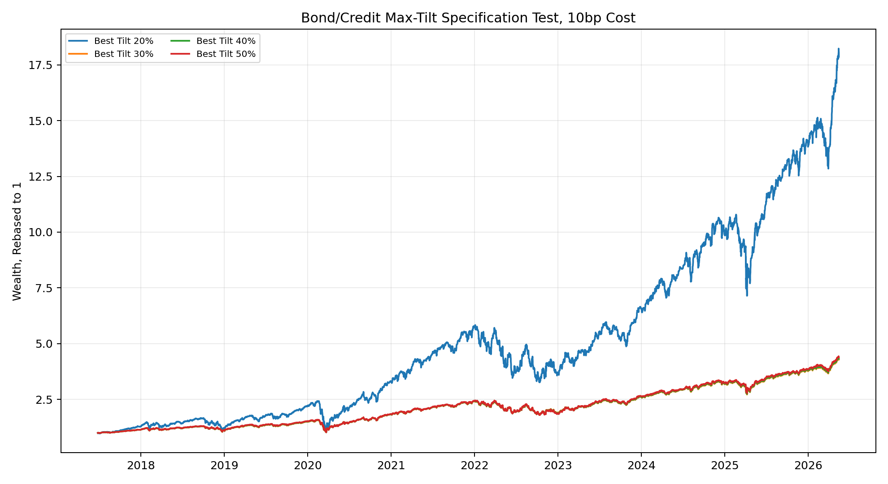
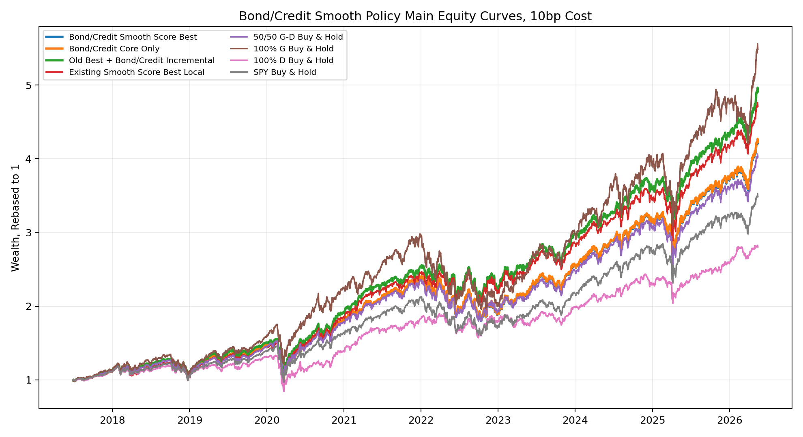
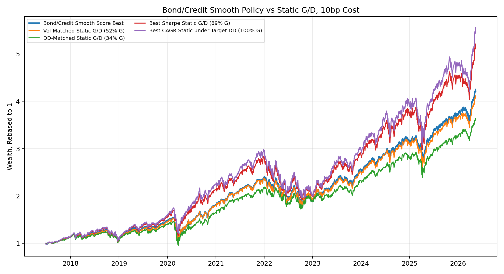
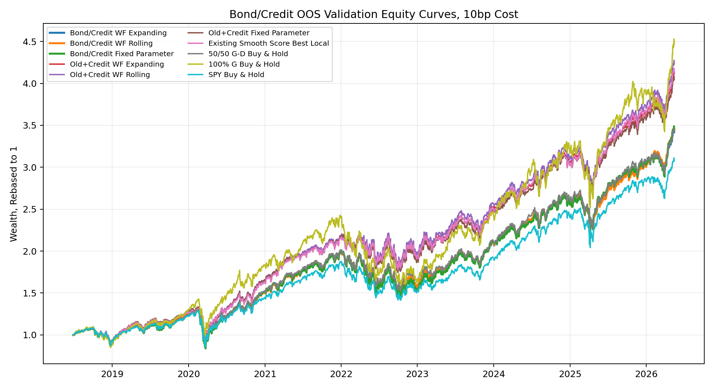
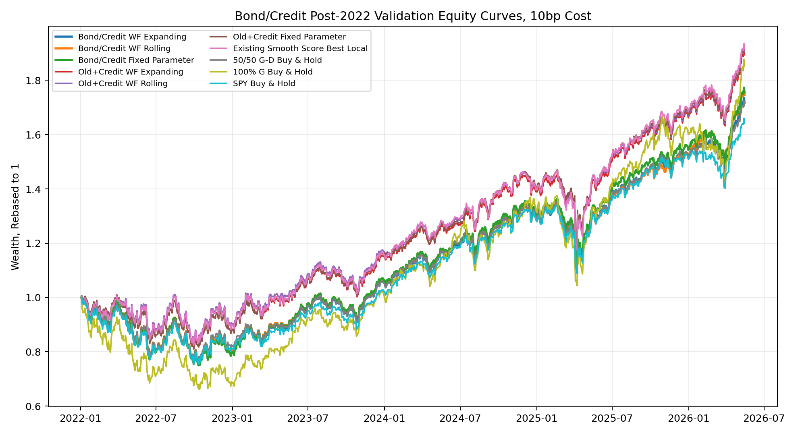

# Phase 1 Bond/Credit-Augmented Smooth Policy Full Report

Report scope: full Phase 1 extension after adding aligned bond and credit variables. This is an empirical report, not a manuscript.

## 0. Scope

This report follows the structure of the 2016 full Phase 1 report. It keeps the original factor-attribution boundary unchanged and adds a new bond/credit-augmented smooth-score policy module. The recent-only HY/IG OAS data are excluded from formal policy tests because they do not align with the full 2017-2026 policy window.

## 1. Data Start and Warmup

- G/D source returns start on `2016-12-21`.
- Complete policy comparison starts after natural trailing-signal warmup on `2017-06-28`.
- Main aligned policy comparison: `2017-06-28` to `2026-05-15`.
- All policy tests use daily trading-day data.
- Signals are formed after the close and deployed on the next trading day.

## 2. Module 1: Factor Attribution Boundary

This extension does not rerun or reinterpret the FF5+MOM attribution. The original Phase 1 attribution remains the boundary condition: `G-D` is a style-exposure portfolio, not a newly discovered standalone alpha factor.

| portfolio | n | alpha_ann | alpha_t_NW | MKT | SMB | HML | RMW | CMA | MOM | adj_R2 |
| --- | --- | --- | --- | --- | --- | --- | --- | --- | --- | --- |
| G | 2330 | 2.24% | 1.51 | 1.148 | -0.118 | -0.298 | 0.067 | -0.071 | 0.041 | 0.965 |
| D | 2330 | 0.29% | 0.24 | 0.874 | 0.019 | 0.254 | 0.088 | 0.227 | -0.076 | 0.950 |
| G-D | 2330 | 1.95% | 0.81 | 0.273 | -0.137 | -0.552 | -0.021 | -0.298 | 0.117 | 0.757 |

Interpretation: `G-D` has positive market beta, strongly negative HML exposure, negative CMA exposure, and positive MOM exposure. Its annualized alpha is positive but not statistically significant under Newey-West standard errors. Therefore the bond/credit extension is evaluated as a timing overlay for known style exposures, not as a test of a new independent alpha.

## 3. Diagnostic Gate Summary

The bond/credit diagnostic gate identifies three main effects and one interaction worth carrying into the policy test:

| variable | question | coef_63d | t_hac_63d | nonoverlap_coef_63d | passes_gate |
| --- | --- | --- | --- | --- | --- |
| d | SPY drawdown depth: -z(SPY drawdown) | 12.67% | 3.51 | 10.12% | True |
| g126 | G-D trailing 126d relative strength | -2.17% | -2.25 | -3.49% | True |
| ce | Credit relief: -z(BAA-10Y spread 21d change) | 1.31% | 1.70 | 0.14% | True |

| variable | question | coef_63d | t_hac_63d | resid_coef_63d | resid_t_63d | final_pass |
| --- | --- | --- | --- | --- | --- | --- |
| r_x_cs | Rate relief: -z(10Y yield 21d change) × Credit stress level: z(BAA-10Y spread) | 1.71% | 1.51 | 2.07% | 2.36 | True |

## 4. Bond/Credit Smooth Score Formula

Direction-normalized variables:

```text
d      = -expanding_z(SPY drawdown)
ce     = -expanding_z(BAA10Y spread 21d change)
g126   =  expanding_z(G-D trailing 126d)
cs     =  expanding_z(BAA10Y spread)
r      = -expanding_z(10Y yield 21d change)
z_r_cs =  expanding_z(r * cs)

score = alpha_d * d
      + (1 - alpha_d) * ce
      - lambda_g126 * g126
      + lambda_interaction * z_r_cs
```

Weight mapping:

```text
G_target = 50% + max_tilt * tanh(expanding_z(score) / tau_weight)
G_weight_t = (1 - eta) * G_weight_{t-1} + eta * G_target_t
D_weight_t = 1 - G_weight_t
```

Selected configuration:

| config_id | alpha_d | lambda_credit | lambda_g126 | lambda_interaction | max_tilt | tau_weight | eta |
| --- | --- | --- | --- | --- | --- | --- | --- |
| bc_a0.67_lc0.50_lg0.10_li0.10_tilt0.20_tau0.75_eta0.05 | 0.67 | 0.50 | 0.10 | 0.10 | 0.20 | 0.75 | 0.05 |

Strict incremental design:

The `Old Best + Bond/Credit Incremental` experiment keeps the original Best Local structure fixed at `alpha=0.50`, `lambda_stress=0.50`, `lambda_crowded=0.05`, `max_tilt=0.50`, `tau_weight=0.75`, and `eta=0.05`. It only adds two bond/credit terms: `credit relief` and `rate relief × credit stress`. This is the strict test of whether bond/credit information improves the old main strategy rather than replacing it.

| config_id | lambda_credit | lambda_interaction | max_tilt | tau_weight | eta |
| --- | --- | --- | --- | --- | --- |
| old_plus_credit_lc0.10_li0.50 | 0.10 | 0.50 | 0.50 | 0.75 | 0.05 |

## 5. Grid and Tilt Test

Total candidate configurations tested: `793`.

| max_tilt | config_id | cagr | ann_vol | sharpe | max_drawdown | calmar | annual_turnover | selection_score |
| --- | --- | --- | --- | --- | --- | --- | --- | --- |
| 20.00% | bc_a0.67_lc0.50_lg0.10_li0.10_tilt0.20_tau0.75_eta0.05 | 17.73% | 19.49% | 0.94 | -34.50% | 0.51 | 170.28% | 0.81 |
| 30.00% | bc_a0.67_lc0.25_lg0.10_li0.10_tilt0.30_tau0.75_eta0.03 | 17.86% | 19.56% | 0.94 | -34.79% | 0.51 | 178.59% | 0.79 |
| 40.00% | bc_a0.67_lc0.50_lg0.10_li0.10_tilt0.40_tau1.00_eta0.03 | 17.98% | 19.69% | 0.94 | -35.13% | 0.51 | 210.89% | 0.76 |
| 50.00% | bc_a0.67_lc0.50_lg0.10_li0.10_tilt0.50_tau1.00_eta0.03 | 18.18% | 19.83% | 0.94 | -35.55% | 0.51 | 263.61% | 0.71 |



## 6. Cost Sensitivity of Selected Configuration

Bond/Credit Smooth Score Best:

| cost_bps | cagr | ann_vol | sharpe | max_drawdown | calmar | annual_turnover | avg_g_weight | final_wealth |
| --- | --- | --- | --- | --- | --- | --- | --- | --- |
| 0 | 17.93% | 19.49% | 0.94 | -34.49% | 0.52 | 170.28% | 49.62% | 4.31 |
| 5 | 17.83% | 19.49% | 0.94 | -34.50% | 0.52 | 170.28% | 49.62% | 4.28 |
| 10 | 17.73% | 19.49% | 0.94 | -34.50% | 0.51 | 170.28% | 49.62% | 4.25 |
| 20 | 17.53% | 19.49% | 0.93 | -34.51% | 0.51 | 170.28% | 49.62% | 4.18 |

Old Best + Bond/Credit Incremental:

| cost_bps | cagr | ann_vol | sharpe | max_drawdown | calmar | annual_turnover | avg_g_weight | final_wealth |
| --- | --- | --- | --- | --- | --- | --- | --- | --- |
| 0 | 20.29% | 19.14% | 1.06 | -31.87% | 0.64 | 410.23% | 43.72% | 5.14 |
| 5 | 20.05% | 19.14% | 1.05 | -31.89% | 0.63 | 410.23% | 43.72% | 5.05 |
| 10 | 19.80% | 19.14% | 1.04 | -31.92% | 0.62 | 410.23% | 43.72% | 4.96 |
| 20 | 19.31% | 19.14% | 1.02 | -31.97% | 0.60 | 410.23% | 43.72% | 4.78 |

## 7. Main Aligned Strategy Comparison

| display_name | start_date | end_date | cagr | ann_vol | sharpe | max_drawdown | calmar | annual_turnover | avg_g_weight | final_wealth |
| --- | --- | --- | --- | --- | --- | --- | --- | --- | --- | --- |
| Bond/Credit Smooth Score Best | 2017-06-28 | 2026-05-15 | 17.73% | 19.49% | 0.94 | -34.50% | 0.51 | 170.28% | 49.62% | 4.25 |
| Bond/Credit Core Only | 2017-06-28 | 2026-05-15 | 17.79% | 19.49% | 0.94 | -34.48% | 0.52 | 160.35% | 49.55% | 4.27 |
| Old Best + Bond/Credit Incremental | 2017-06-28 | 2026-05-15 | 19.80% | 19.14% | 1.04 | -31.92% | 0.62 | 410.23% | 43.72% | 4.96 |
| Existing Smooth Score Best Local | 2017-06-28 | 2026-05-15 | 19.24% | 19.29% | 1.01 | -31.63% | 0.61 | 469.67% | 45.06% | 4.76 |
| 50/50 G-D Buy & Hold | 2017-06-28 | 2026-05-15 | 17.12% | 19.34% | 0.91 | -33.59% | 0.51 | 0.00% | 50.00% | 4.06 |
| 100% G Buy & Hold | 2017-06-28 | 2026-05-15 | 21.34% | 23.53% | 0.94 | -34.35% | 0.62 | 0.00% | 100.00% | 5.55 |
| 100% D Buy & Hold | 2017-06-28 | 2026-05-15 | 12.42% | 17.53% | 0.76 | -36.71% | 0.34 | 0.00% | 0.00% | 2.82 |
| SPY Buy & Hold | 2017-06-28 | 2026-05-15 | 15.25% | 18.74% | 0.85 | -33.72% | 0.45 | 0.00% |  | 3.52 |

### 7.1 Incremental Comparison

| comparison | annualized_excess_return | max_dd_diff | sharpe_diff | turnover_diff |
| --- | --- | --- | --- | --- |
| Bond/Credit Best - Bond/Credit Core Only | -0.06% | -0.03% | -0.00 | 9.93% |
| Bond/Credit Best - Old Best + Bond/Credit Incremental | -2.07% | -2.59% | -0.10 | -239.95% |
| Bond/Credit Best - Existing Smooth Score Best Local | -1.51% | -2.87% | -0.07 | -299.40% |
| Bond/Credit Best - 50/50 G-D Buy & Hold | 0.61% | -0.92% | 0.02 | 170.28% |
| Bond/Credit Best - 100% G Buy & Hold | -3.61% | -0.16% | -0.00 | 170.28% |
| Bond/Credit Best - 100% D Buy & Hold | 5.31% | 2.21% | 0.18 | 170.28% |
| Bond/Credit Best - SPY Buy & Hold | 2.48% | -0.79% | 0.08 | 170.28% |
| Old Best + Bond/Credit Incremental - Existing Smooth Score Best Local | 0.56% | -0.28% | 0.03 | -59.44% |
| Old Best + Bond/Credit Incremental - Bond/Credit Smooth Score Best | 2.07% | 2.59% | 0.10 | 239.95% |

### 7.2 Equity Curves



## 8. Vol-Matched and Static G/D Comparisons

| display_name | static_g_weight | final_wealth | cagr | ann_vol | sharpe | max_drawdown | calmar | annual_turnover | avg_g_weight |
| --- | --- | --- | --- | --- | --- | --- | --- | --- | --- |
| Target Bond/Credit Smooth Score |  | 4.25 | 17.73% | 19.49% | 0.94 | -34.50% | 0.51 | 170.28% | 49.62% |
| Vol-Matched Static G/D (52% G) | 52.00% | 4.11 | 17.30% | 19.47% | 0.92 | -33.48% | 0.52 | 0.00% | 52.00% |
| DD-Matched Static G/D (34% G) | 34.00% | 3.63 | 15.67% | 18.45% | 0.88 | -34.50% | 0.45 | 0.00% | 34.00% |
| Best Sharpe Static G/D (89% G) | 89.00% | 5.20 | 20.46% | 22.46% | 0.94 | -32.07% | 0.64 | 0.00% | 89.00% |
| Best CAGR Static under Target DD (100% G) | 100.00% | 5.55 | 21.34% | 23.53% | 0.94 | -34.35% | 0.62 | 0.00% | 100.00% |



## 9. OOS Validation: Expanding, Rolling, and Fixed Parameter

| display_name | start_date | end_date | cagr | ann_vol | sharpe | max_drawdown | calmar | annual_turnover | avg_g_weight | final_wealth |
| --- | --- | --- | --- | --- | --- | --- | --- | --- | --- | --- |
| Bond/Credit WF Expanding | 2018-06-28 | 2026-05-15 | 17.02% | 20.14% | 0.88 | -35.55% | 0.48 | 221.17% | 48.65% | 3.44 |
| Bond/Credit WF Rolling | 2018-06-28 | 2026-05-15 | 17.16% | 20.02% | 0.89 | -35.55% | 0.48 | 228.98% | 47.12% | 3.47 |
| Bond/Credit Fixed Parameter | 2018-06-28 | 2026-05-15 | 17.15% | 20.42% | 0.88 | -34.99% | 0.49 | 468.63% | 49.50% | 3.47 |
| Old+Credit WF Expanding | 2018-06-28 | 2026-05-15 | 19.83% | 19.74% | 1.02 | -32.36% | 0.61 | 388.44% | 43.26% | 4.15 |
| Old+Credit WF Rolling | 2018-06-28 | 2026-05-15 | 20.24% | 19.76% | 1.03 | -32.36% | 0.63 | 403.31% | 43.11% | 4.26 |
| Old+Credit Fixed Parameter | 2018-06-28 | 2026-05-15 | 19.56% | 19.52% | 1.01 | -32.54% | 0.60 | 412.32% | 42.74% | 4.07 |
| Existing Smooth Score Best Local | 2018-06-28 | 2026-05-15 | 19.93% | 19.92% | 1.01 | -31.63% | 0.63 | 449.41% | 44.35% | 4.17 |
| 50/50 G-D Buy & Hold | 2018-06-28 | 2026-05-15 | 17.10% | 20.00% | 0.89 | -33.59% | 0.51 | 0.00% | 50.00% | 3.46 |
| 100% G Buy & Hold | 2018-06-28 | 2026-05-15 | 21.13% | 24.38% | 0.91 | -34.35% | 0.62 | 0.00% | 100.00% | 4.51 |
| SPY Buy & Hold | 2018-06-28 | 2026-05-15 | 15.45% | 19.39% | 0.84 | -33.72% | 0.46 | 0.00% |  | 3.09 |



## 10. Post-2022 OOS Validation

| display_name | start_date | end_date | cagr | ann_vol | sharpe | max_drawdown | calmar | annual_turnover | avg_g_weight | final_wealth |
| --- | --- | --- | --- | --- | --- | --- | --- | --- | --- | --- |
| Bond/Credit WF Expanding | 2022-01-03 | 2026-05-15 | 13.39% | 18.33% | 0.78 | -25.14% | 0.53 | 101.55% | 49.38% | 1.73 |
| Bond/Credit WF Rolling | 2022-01-03 | 2026-05-15 | 13.83% | 17.97% | 0.81 | -24.55% | 0.56 | 119.91% | 45.97% | 1.76 |
| Bond/Credit Fixed Parameter | 2022-01-03 | 2026-05-15 | 13.95% | 18.42% | 0.80 | -25.13% | 0.56 | 129.02% | 49.68% | 1.76 |
| Old+Credit WF Expanding | 2022-01-03 | 2026-05-15 | 15.95% | 17.27% | 0.94 | -19.76% | 0.81 | 365.74% | 38.27% | 1.90 |
| Old+Credit WF Rolling | 2022-01-03 | 2026-05-15 | 16.12% | 17.28% | 0.95 | -19.45% | 0.83 | 382.49% | 37.51% | 1.92 |
| Old+Credit Fixed Parameter | 2022-01-03 | 2026-05-15 | 16.20% | 17.24% | 0.96 | -19.68% | 0.82 | 368.67% | 37.65% | 1.92 |
| Existing Smooth Score Best Local | 2022-01-03 | 2026-05-15 | 16.27% | 17.66% | 0.94 | -19.94% | 0.82 | 455.76% | 40.68% | 1.93 |
| 50/50 G-D Buy & Hold | 2022-01-03 | 2026-05-15 | 13.23% | 18.02% | 0.78 | -23.78% | 0.56 | 0.00% | 50.00% | 1.72 |
| 100% G Buy & Hold | 2022-01-03 | 2026-05-15 | 15.45% | 23.81% | 0.72 | -33.92% | 0.46 | 0.00% | 100.00% | 1.87 |
| SPY Buy & Hold | 2022-01-03 | 2026-05-15 | 12.21% | 17.68% | 0.74 | -24.50% | 0.50 | 0.00% |  | 1.65 |



## 11. Score Sorting Diagnostics

| score_quantile | n | start_date | end_date | realized_future_gd_mean_63d | realized_future_gd_median_63d | win_rate |
| --- | --- | --- | --- | --- | --- | --- |
| Q1 | 434 | 2017-07-12 | 2025-12-10 | 0.03% | 0.26% | 51.84% |
| Q2 | 434 | 2017-07-13 | 2026-01-13 | 0.66% | 1.54% | 58.99% |
| Q3 | 434 | 2017-07-07 | 2026-02-13 | 2.83% | 3.35% | 71.66% |
| Q4 | 434 | 2017-06-28 | 2026-02-05 | 2.39% | 3.40% | 64.98% |
| Q5 | 434 | 2017-07-03 | 2023-04-26 | 3.08% | 4.32% | 71.43% |

## 12. Yearly Performance

| display_name | year | start_date | end_date | cagr | sharpe | max_drawdown | annual_turnover | avg_g_weight |
| --- | --- | --- | --- | --- | --- | --- | --- | --- |
| 100% G Buy & Hold | 2017 | 2017-06-28 | 2017-12-29 | 29.53% | 2.73 | -2.40% | 0.00% | 100.00% |
| 100% G Buy & Hold | 2018 | 2018-01-02 | 2018-12-31 | -0.60% | 0.08 | -22.54% | 0.00% | 100.00% |
| 100% G Buy & Hold | 2019 | 2019-01-02 | 2019-12-31 | 41.00% | 2.27 | -9.27% | 0.00% | 100.00% |
| 100% G Buy & Hold | 2020 | 2020-01-02 | 2020-12-31 | 42.24% | 1.14 | -30.81% | 0.00% | 100.00% |
| 100% G Buy & Hold | 2021 | 2021-01-04 | 2021-12-31 | 30.41% | 1.57 | -9.83% | 0.00% | 100.00% |
| 100% G Buy & Hold | 2022 | 2022-01-03 | 2022-12-30 | -30.61% | -0.97 | -33.92% | 0.00% | 100.00% |
| 100% G Buy & Hold | 2023 | 2023-01-03 | 2023-12-29 | 48.31% | 2.43 | -10.69% | 0.00% | 100.00% |
| 100% G Buy & Hold | 2024 | 2024-01-02 | 2024-12-31 | 29.06% | 1.43 | -14.22% | 0.00% | 100.00% |
| 100% G Buy & Hold | 2025 | 2025-01-02 | 2025-12-31 | 22.00% | 0.92 | -24.06% | 0.00% | 100.00% |
| 100% G Buy & Hold | 2026 | 2026-01-02 | 2026-05-15 | 48.22% | 2.03 | -13.46% | 0.00% | 100.00% |
| 50/50 G-D Buy & Hold | 2017 | 2017-06-28 | 2017-12-29 | 27.03% | 3.35 | -2.08% | 0.00% | 50.00% |
| 50/50 G-D Buy & Hold | 2018 | 2018-01-02 | 2018-12-31 | -3.03% | -0.08 | -19.71% | 0.00% | 50.00% |
| 50/50 G-D Buy & Hold | 2019 | 2019-01-02 | 2019-12-31 | 32.90% | 2.19 | -8.03% | 0.00% | 50.00% |
| 50/50 G-D Buy & Hold | 2020 | 2020-01-02 | 2020-12-31 | 23.71% | 0.79 | -33.59% | 0.00% | 50.00% |
| 50/50 G-D Buy & Hold | 2021 | 2021-01-04 | 2021-12-31 | 31.04% | 2.08 | -4.92% | 0.00% | 50.00% |
| 50/50 G-D Buy & Hold | 2022 | 2022-01-03 | 2022-12-30 | -17.12% | -0.62 | -23.78% | 0.00% | 50.00% |
| 50/50 G-D Buy & Hold | 2023 | 2023-01-03 | 2023-12-29 | 28.40% | 1.93 | -9.73% | 0.00% | 50.00% |
| 50/50 G-D Buy & Hold | 2024 | 2024-01-02 | 2024-12-31 | 22.51% | 1.60 | -8.88% | 0.00% | 50.00% |
| 50/50 G-D Buy & Hold | 2025 | 2025-01-02 | 2025-12-31 | 17.46% | 0.94 | -19.66% | 0.00% | 50.00% |
| 50/50 G-D Buy & Hold | 2026 | 2026-01-02 | 2026-05-15 | 37.22% | 2.39 | -7.95% | 0.00% | 50.00% |
| Existing Smooth Score Best Local | 2017 | 2017-06-28 | 2017-12-29 | 23.19% | 2.92 | -2.03% | 656.03% | 47.83% |
| Existing Smooth Score Best Local | 2018 | 2018-01-02 | 2018-12-31 | -3.33% | -0.09 | -19.60% | 604.88% | 56.09% |
| Existing Smooth Score Best Local | 2019 | 2019-01-02 | 2019-12-31 | 35.12% | 2.17 | -8.38% | 533.41% | 64.38% |
| Existing Smooth Score Best Local | 2020 | 2020-01-02 | 2020-12-31 | 28.88% | 0.91 | -31.63% | 438.04% | 53.02% |
| Existing Smooth Score Best Local | 2021 | 2021-01-04 | 2021-12-31 | 31.65% | 2.26 | -4.72% | 268.14% | 24.39% |
| Existing Smooth Score Best Local | 2022 | 2022-01-03 | 2022-12-30 | -9.53% | -0.31 | -18.04% | 640.34% | 40.06% |
| Existing Smooth Score Best Local | 2023 | 2023-01-03 | 2023-12-29 | 29.38% | 1.97 | -9.59% | 362.57% | 40.82% |
| Existing Smooth Score Best Local | 2024 | 2024-01-02 | 2024-12-31 | 20.40% | 1.57 | -7.16% | 352.67% | 31.48% |
| Existing Smooth Score Best Local | 2025 | 2025-01-02 | 2025-12-31 | 20.53% | 1.03 | -19.94% | 409.22% | 49.67% |
| Existing Smooth Score Best Local | 2026 | 2026-01-02 | 2026-05-15 | 41.77% | 2.79 | -7.33% | 612.58% | 42.76% |
| Bond/Credit Smooth Score Best | 2017 | 2017-06-28 | 2017-12-29 | 28.01% | 3.43 | -2.12% | 278.98% | 50.66% |
| Bond/Credit Smooth Score Best | 2018 | 2018-01-02 | 2018-12-31 | -1.90% | -0.02 | -19.75% | 247.21% | 50.14% |
| Bond/Credit Smooth Score Best | 2019 | 2019-01-02 | 2019-12-31 | 33.64% | 2.24 | -7.75% | 161.79% | 46.86% |
| Bond/Credit Smooth Score Best | 2020 | 2020-01-02 | 2020-12-31 | 23.16% | 0.78 | -34.50% | 226.75% | 48.27% |
| Bond/Credit Smooth Score Best | 2021 | 2021-01-04 | 2021-12-31 | 31.26% | 2.06 | -4.90% | 169.24% | 52.41% |
| Bond/Credit Smooth Score Best | 2022 | 2022-01-03 | 2022-12-30 | -19.67% | -0.67 | -25.13% | 83.65% | 65.18% |
| Bond/Credit Smooth Score Best | 2023 | 2023-01-03 | 2023-12-29 | 33.83% | 2.18 | -9.62% | 154.60% | 54.88% |
| Bond/Credit Smooth Score Best | 2024 | 2024-01-02 | 2024-12-31 | 22.18% | 1.70 | -7.46% | 130.80% | 39.24% |
| Bond/Credit Smooth Score Best | 2025 | 2025-01-02 | 2025-12-31 | 18.54% | 1.02 | -18.61% | 125.58% | 41.00% |
| Bond/Credit Smooth Score Best | 2026 | 2026-01-02 | 2026-05-15 | 41.46% | 2.68 | -7.86% | 187.15% | 45.43% |
| Old Best + Bond/Credit Incremental | 2017 | 2017-06-28 | 2017-12-29 | 28.68% | 3.51 | -2.08% | 673.29% | 50.35% |
| Old Best + Bond/Credit Incremental | 2018 | 2018-01-02 | 2018-12-31 | -1.34% | 0.02 | -19.43% | 591.54% | 59.53% |
| Old Best + Bond/Credit Incremental | 2019 | 2019-01-02 | 2019-12-31 | 34.96% | 2.18 | -8.27% | 522.82% | 62.77% |
| Old Best + Bond/Credit Incremental | 2020 | 2020-01-02 | 2020-12-31 | 28.11% | 0.89 | -31.92% | 458.25% | 51.51% |
| Old Best + Bond/Credit Incremental | 2021 | 2021-01-04 | 2021-12-31 | 31.45% | 2.25 | -4.65% | 162.82% | 22.54% |
| Old Best + Bond/Credit Incremental | 2022 | 2022-01-03 | 2022-12-30 | -10.63% | -0.35 | -19.16% | 541.82% | 42.64% |
| Old Best + Bond/Credit Incremental | 2023 | 2023-01-03 | 2023-12-29 | 31.61% | 2.09 | -9.46% | 254.85% | 41.93% |
| Old Best + Bond/Credit Incremental | 2024 | 2024-01-02 | 2024-12-31 | 20.61% | 1.68 | -5.89% | 286.93% | 24.83% |
| Old Best + Bond/Credit Incremental | 2025 | 2025-01-02 | 2025-12-31 | 20.16% | 1.06 | -18.65% | 297.92% | 41.47% |
| Old Best + Bond/Credit Incremental | 2026 | 2026-01-02 | 2026-05-15 | 43.42% | 2.92 | -7.10% | 489.28% | 41.35% |

## 13. Final Interpretation

- The bond/credit extension adds an economically interpretable credit-relief channel and a `rate relief × credit stress` interaction.
- The strict incremental branch tests whether those terms improve the already-selected old Best Local structure, instead of comparing a new score against the old score only.
- This report evaluates whether that additional information improves the deployable G/D smooth policy, not whether it creates a new standalone alpha factor.
- Results should be interpreted against the existing smooth-score benchmark, static G/D allocations, 100% G, SPY, and OOS validation paths.

## 14. Output Files

- `/Users/zhelixiong/Desktop/research/doctor/github_package/phase1/phase1_2016_full_archive/data/phase1/bond_credit_smooth_policy_v1/inputs/bond_credit_smooth_policy_v1_feature_panel.csv`
- `/Users/zhelixiong/Desktop/research/doctor/github_package/phase1/phase1_2016_full_archive/data/phase1/bond_credit_smooth_policy_v1/tables/bond_credit_smooth_policy_v1_config_grid.csv`
- `/Users/zhelixiong/Desktop/research/doctor/github_package/phase1/phase1_2016_full_archive/data/phase1/bond_credit_smooth_policy_v1/tables/bond_credit_smooth_policy_v1_grid_metrics.csv`
- `/Users/zhelixiong/Desktop/research/doctor/github_package/phase1/phase1_2016_full_archive/data/phase1/bond_credit_smooth_policy_v1/tables/bond_credit_smooth_policy_v1_selected_summary.csv`
- `/Users/zhelixiong/Desktop/research/doctor/github_package/phase1/phase1_2016_full_archive/data/phase1/bond_credit_smooth_policy_v1/tables/bond_credit_smooth_policy_v1_main_equity_curves.csv`
- `/Users/zhelixiong/Desktop/research/doctor/github_package/phase1/phase1_2016_full_archive/data/phase1/bond_credit_smooth_policy_v1/tables/bond_credit_smooth_policy_v1_oos_validation_summary.csv`
- `/Users/zhelixiong/Desktop/research/doctor/github_package/phase1/phase1_2016_full_archive/data/phase1/bond_credit_smooth_policy_v1/tables/bond_credit_smooth_policy_v1_post2022_validation_summary.csv`
