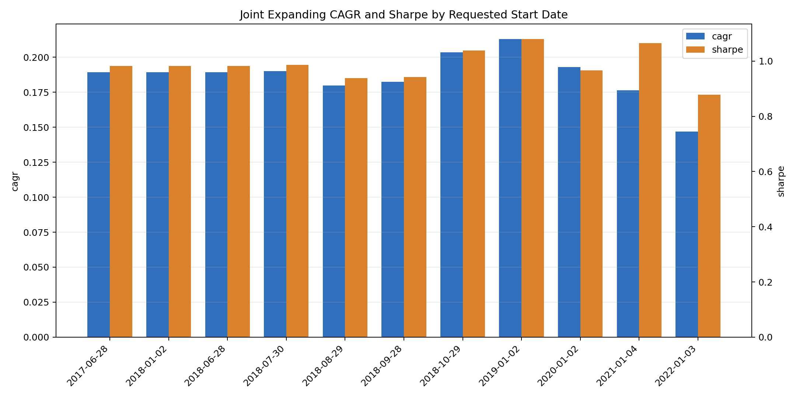
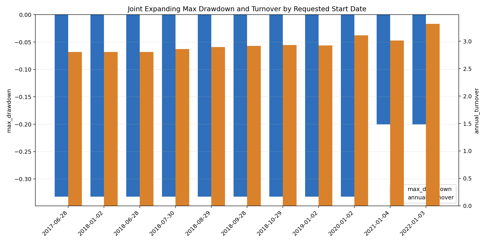
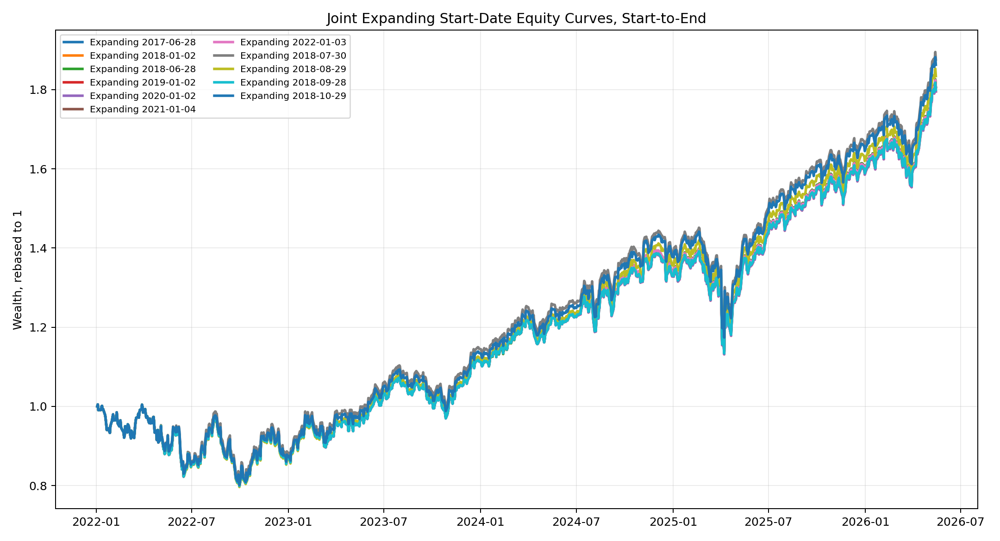
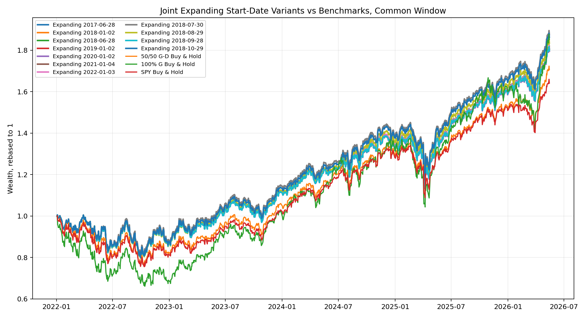

# Expanding Start-Date Sensitivity v1

This report is the expanding-window counterpart to the rolling start-date sensitivity test. The model, full 1,600-configuration Joint Old/Credit grid, 63-day test block, 10bp transaction cost, and selection score are kept unchanged. Only the requested OOS start date and 63-day block phase are varied.

Important distinction: this is a start-date sensitivity test, not a parameter-grid sensitivity test. The parameter grid remains full-grid in every run.

## 1. Tested Start Dates

| start_group | requested_start_date |
| --- | --- |
| annual | 2017-06-28 |
| annual | 2018-01-02 |
| annual_block_phase_anchor | 2018-06-28 |
| annual | 2019-01-02 |
| annual | 2020-01-02 |
| annual | 2021-01-04 |
| annual | 2022-01-03 |
| block_phase | 2018-07-30 |
| block_phase | 2018-08-29 |
| block_phase | 2018-09-28 |
| block_phase | 2018-10-29 |

## 2. Start-to-End Joint Expanding Results

Each requested start date is run to the common dataset end. The `actual_start_date` can be later than the requested date when the validation requires the initial training window.

| requested_start_date | actual_start_date | start_group | start_date | end_date | n_days | cagr | ann_vol | sharpe | max_drawdown | calmar | annual_turnover | avg_g_weight | final_wealth |
| --- | --- | --- | --- | --- | --- | --- | --- | --- | --- | --- | --- | --- | --- |
| 2017-06-28 | 2018-06-28 | annual | 2018-06-28 | 2026-05-15 | 1981 | 18.93% | 19.62% | 0.98 | -33.25% | 0.57 | 280.43% | 42.77% | 3.91 |
| 2018-01-02 | 2018-06-28 | annual | 2018-06-28 | 2026-05-15 | 1981 | 18.93% | 19.62% | 0.98 | -33.25% | 0.57 | 280.43% | 42.77% | 3.91 |
| 2018-06-28 | 2018-06-28 | annual_block_phase_anchor | 2018-06-28 | 2026-05-15 | 1981 | 18.93% | 19.62% | 0.98 | -33.25% | 0.57 | 280.43% | 42.77% | 3.91 |
| 2018-07-30 | 2018-07-30 | block_phase | 2018-07-30 | 2026-05-15 | 1960 | 19.01% | 19.61% | 0.99 | -33.25% | 0.57 | 285.68% | 42.20% | 3.87 |
| 2018-08-29 | 2018-08-29 | block_phase | 2018-08-29 | 2026-05-15 | 1938 | 17.98% | 19.70% | 0.94 | -33.25% | 0.54 | 289.34% | 41.26% | 3.57 |
| 2018-09-28 | 2018-09-28 | block_phase | 2018-09-28 | 2026-05-15 | 1917 | 18.25% | 19.90% | 0.94 | -33.25% | 0.55 | 291.25% | 42.42% | 3.58 |
| 2018-10-29 | 2018-10-29 | block_phase | 2018-10-29 | 2026-05-15 | 1896 | 20.34% | 19.71% | 1.04 | -33.25% | 0.61 | 293.01% | 41.64% | 4.03 |
| 2019-01-02 | 2019-01-02 | annual | 2019-01-02 | 2026-05-15 | 1853 | 21.30% | 19.68% | 1.08 | -33.25% | 0.64 | 292.43% | 42.12% | 4.14 |
| 2020-01-02 | 2020-01-02 | annual | 2020-01-02 | 2026-05-15 | 1601 | 19.29% | 20.44% | 0.97 | -33.25% | 0.58 | 310.54% | 39.02% | 3.07 |
| 2021-01-04 | 2021-01-04 | annual | 2021-01-04 | 2026-05-15 | 1348 | 17.63% | 16.52% | 1.07 | -20.03% | 0.88 | 301.18% | 36.19% | 2.38 |
| 2022-01-03 | 2022-01-03 | annual | 2022-01-03 | 2026-05-15 | 1096 | 14.69% | 17.31% | 0.88 | -20.03% | 0.73 | 331.69% | 38.00% | 1.81 |

## 3. Common-Window Results

Common window: `2022-01-03` to `2026-05-15`. All expanding start-date variants and benchmarks are evaluated on the same dates.

| display_name | requested_start_date | actual_start_date | start_date | end_date | n_days | cagr | ann_vol | sharpe | max_drawdown | calmar | annual_turnover | avg_g_weight | final_wealth |
| --- | --- | --- | --- | --- | --- | --- | --- | --- | --- | --- | --- | --- | --- |
| Joint Expanding 2017-06-28 | 2017-06-28 | 2018-06-28 | 2022-01-03 | 2026-05-15 | 1096 | 14.72% | 17.31% | 0.88 | -20.41% | 0.72 | 323.83% | 38.13% | 1.82 |
| Joint Expanding 2018-01-02 | 2018-01-02 | 2018-06-28 | 2022-01-03 | 2026-05-15 | 1096 | 14.72% | 17.31% | 0.88 | -20.41% | 0.72 | 323.83% | 38.13% | 1.82 |
| Joint Expanding 2018-06-28 | 2018-06-28 | 2018-06-28 | 2022-01-03 | 2026-05-15 | 1096 | 14.72% | 17.31% | 0.88 | -20.41% | 0.72 | 323.83% | 38.13% | 1.82 |
| Joint Expanding 2019-01-02 | 2019-01-02 | 2019-01-02 | 2022-01-03 | 2026-05-15 | 1096 | 14.55% | 17.31% | 0.87 | -20.57% | 0.71 | 332.18% | 37.99% | 1.81 |
| Joint Expanding 2020-01-02 | 2020-01-02 | 2020-01-02 | 2022-01-03 | 2026-05-15 | 1096 | 14.55% | 17.31% | 0.87 | -20.57% | 0.71 | 332.18% | 37.99% | 1.81 |
| Joint Expanding 2021-01-04 | 2021-01-04 | 2021-01-04 | 2022-01-03 | 2026-05-15 | 1096 | 14.69% | 17.31% | 0.88 | -20.03% | 0.73 | 331.69% | 38.00% | 1.81 |
| Joint Expanding 2022-01-03 | 2022-01-03 | 2022-01-03 | 2022-01-03 | 2026-05-15 | 1096 | 14.69% | 17.31% | 0.88 | -20.03% | 0.73 | 331.69% | 38.00% | 1.81 |
| Joint Expanding 2018-07-30 | 2018-07-30 | 2018-07-30 | 2022-01-03 | 2026-05-15 | 1096 | 15.70% | 17.19% | 0.93 | -19.44% | 0.81 | 330.90% | 37.86% | 1.89 |
| Joint Expanding 2018-08-29 | 2018-08-29 | 2018-08-29 | 2022-01-03 | 2026-05-15 | 1096 | 15.11% | 17.18% | 0.90 | -20.76% | 0.73 | 330.69% | 37.45% | 1.84 |
| Joint Expanding 2018-09-28 | 2018-09-28 | 2018-09-28 | 2022-01-03 | 2026-05-15 | 1096 | 14.60% | 17.31% | 0.87 | -20.51% | 0.71 | 331.97% | 37.98% | 1.81 |
| Joint Expanding 2018-10-29 | 2018-10-29 | 2018-10-29 | 2022-01-03 | 2026-05-15 | 1096 | 15.52% | 17.11% | 0.93 | -20.26% | 0.77 | 333.88% | 37.37% | 1.87 |
| 50/50 G-D Buy & Hold | benchmark | 2022-01-03 | 2022-01-03 | 2026-05-15 | 1096 | 13.23% | 18.02% | 0.78 | -23.78% | 0.56 | 0.00% | 50.00% | 1.72 |
| 100% G Buy & Hold | benchmark | 2022-01-03 | 2022-01-03 | 2026-05-15 | 1096 | 15.45% | 23.81% | 0.72 | -33.92% | 0.46 | 0.00% | 100.00% | 1.87 |
| SPY Buy & Hold | benchmark | 2022-01-03 | 2022-01-03 | 2026-05-15 | 1096 | 12.21% | 17.68% | 0.74 | -24.50% | 0.50 | 0.00% |  | 1.65 |

## 4. Fixed-Horizon Results

| horizon_years | requested_start_date | actual_start_date | start_date | end_date | n_days | cagr | ann_vol | sharpe | max_drawdown | calmar | annual_turnover | avg_g_weight | final_wealth |
| --- | --- | --- | --- | --- | --- | --- | --- | --- | --- | --- | --- | --- | --- |
| 3 | 2017-06-28 | 2018-06-28 | 2018-06-28 | 2021-06-29 | 756 | 24.61% | 23.44% | 1.06 | -33.25% | 0.74 | 244.20% | 51.67% | 1.93 |
| 3 | 2018-01-02 | 2018-06-28 | 2018-06-28 | 2021-06-29 | 756 | 24.61% | 23.44% | 1.06 | -33.25% | 0.74 | 244.20% | 51.67% | 1.93 |
| 3 | 2018-06-28 | 2018-06-28 | 2018-06-28 | 2021-06-29 | 756 | 24.61% | 23.44% | 1.06 | -33.25% | 0.74 | 244.20% | 51.67% | 1.93 |
| 3 | 2019-01-02 | 2019-01-02 | 2019-01-02 | 2021-12-30 | 756 | 31.89% | 22.70% | 1.33 | -33.25% | 0.96 | 235.07% | 48.14% | 2.29 |
| 3 | 2020-01-02 | 2020-01-02 | 2020-01-02 | 2022-12-30 | 756 | 14.18% | 25.33% | 0.65 | -33.25% | 0.43 | 363.79% | 41.39% | 1.49 |
| 3 | 2021-01-04 | 2021-01-04 | 2021-01-04 | 2024-01-04 | 756 | 13.51% | 17.41% | 0.82 | -20.03% | 0.67 | 332.58% | 36.38% | 1.46 |
| 3 | 2022-01-03 | 2022-01-03 | 2022-01-03 | 2025-01-06 | 756 | 10.77% | 17.29% | 0.68 | -20.03% | 0.54 | 356.32% | 36.62% | 1.36 |
| 3 | 2018-07-30 | 2018-07-30 | 2018-07-30 | 2021-07-29 | 756 | 23.73% | 23.39% | 1.03 | -33.25% | 0.71 | 242.71% | 50.35% | 1.89 |
| 3 | 2018-08-29 | 2018-08-29 | 2018-08-29 | 2021-08-30 | 756 | 22.22% | 23.40% | 0.98 | -33.25% | 0.67 | 248.30% | 48.24% | 1.83 |
| 3 | 2018-09-28 | 2018-09-28 | 2018-09-28 | 2021-09-29 | 756 | 22.00% | 23.55% | 0.96 | -33.25% | 0.66 | 246.43% | 50.06% | 1.82 |
| 3 | 2018-10-29 | 2018-10-29 | 2018-10-29 | 2021-10-28 | 756 | 27.15% | 23.22% | 1.15 | -33.25% | 0.82 | 242.66% | 48.59% | 2.06 |
| 5 | 2017-06-28 | 2018-06-28 | 2018-06-28 | 2023-06-30 | 1260 | 17.36% | 21.97% | 0.84 | -33.25% | 0.52 | 309.52% | 47.75% | 2.23 |
| 5 | 2018-01-02 | 2018-06-28 | 2018-06-28 | 2023-06-30 | 1260 | 17.36% | 21.97% | 0.84 | -33.25% | 0.52 | 309.52% | 47.75% | 2.23 |
| 5 | 2018-06-28 | 2018-06-28 | 2018-06-28 | 2023-06-30 | 1260 | 17.36% | 21.97% | 0.84 | -33.25% | 0.52 | 309.52% | 47.75% | 2.23 |
| 5 | 2019-01-02 | 2019-01-02 | 2019-01-02 | 2024-01-03 | 1260 | 20.53% | 21.44% | 0.98 | -33.25% | 0.62 | 307.67% | 45.03% | 2.54 |
| 5 | 2020-01-02 | 2020-01-02 | 2020-01-02 | 2025-01-03 | 1260 | 18.03% | 21.21% | 0.89 | -33.25% | 0.54 | 319.77% | 38.47% | 2.29 |
| 5 | 2021-01-04 | 2021-01-04 | 2021-01-04 | 2026-01-08 | 1260 | 16.42% | 16.75% | 0.99 | -20.03% | 0.82 | 296.43% | 35.87% | 2.14 |
| 5 | 2018-07-30 | 2018-07-30 | 2018-07-30 | 2023-08-01 | 1260 | 17.83% | 21.86% | 0.86 | -33.25% | 0.54 | 308.08% | 47.00% | 2.27 |
| 5 | 2018-08-29 | 2018-08-29 | 2018-08-29 | 2023-08-31 | 1260 | 15.61% | 21.89% | 0.77 | -33.25% | 0.47 | 318.43% | 45.29% | 2.07 |
| 5 | 2018-09-28 | 2018-09-28 | 2018-09-28 | 2023-10-02 | 1260 | 14.90% | 22.02% | 0.74 | -33.25% | 0.45 | 312.60% | 46.40% | 2.00 |
| 5 | 2018-10-29 | 2018-10-29 | 2018-10-29 | 2023-10-31 | 1260 | 16.78% | 21.71% | 0.82 | -33.25% | 0.50 | 312.86% | 45.11% | 2.17 |

## 5. Parameter Selection Stability

| requested_start_date | actual_start_date | start_group | n_blocks | unique_selected_configs | switch_count | most_frequent_config | most_frequent_blocks | most_frequent_share |
| --- | --- | --- | --- | --- | --- | --- | --- | --- |
| 2017-06-28 | 2018-06-28 | annual | 32 | 7 | 9 | joint_a0.50_ls0.50_lcrowd0.05_lcred0.25_li0.50_tilt0.50_tau1.00_eta0.05 | 8 | 25.00% |
| 2018-01-02 | 2018-06-28 | annual | 32 | 7 | 9 | joint_a0.50_ls0.50_lcrowd0.05_lcred0.25_li0.50_tilt0.50_tau1.00_eta0.05 | 8 | 25.00% |
| 2018-06-28 | 2018-06-28 | annual_block_phase_anchor | 32 | 7 | 9 | joint_a0.50_ls0.50_lcrowd0.05_lcred0.25_li0.50_tilt0.50_tau1.00_eta0.05 | 8 | 25.00% |
| 2019-01-02 | 2019-01-02 | annual | 30 | 7 | 13 | joint_a0.50_ls0.50_lcrowd0.05_lcred0.25_li0.50_tilt0.50_tau1.00_eta0.05 | 8 | 26.67% |
| 2020-01-02 | 2020-01-02 | annual | 26 | 6 | 11 | joint_a0.50_ls0.50_lcrowd0.05_lcred0.25_li0.50_tilt0.50_tau1.00_eta0.05 | 8 | 30.77% |
| 2021-01-04 | 2021-01-04 | annual | 22 | 5 | 10 | joint_a0.50_ls0.25_lcrowd0.05_lcred0.25_li0.50_tilt0.50_tau1.00_eta0.05 | 8 | 36.36% |
| 2022-01-03 | 2022-01-03 | annual | 18 | 5 | 10 | joint_a0.50_ls0.25_lcrowd0.05_lcred0.25_li0.50_tilt0.50_tau1.00_eta0.05 | 8 | 44.44% |
| 2018-07-30 | 2018-07-30 | block_phase | 32 | 7 | 9 | joint_a0.50_ls0.50_lcrowd0.05_lcred0.25_li0.25_tilt0.50_tau0.75_eta0.05 | 9 | 28.12% |
| 2018-08-29 | 2018-08-29 | block_phase | 31 | 8 | 11 | joint_a0.50_ls0.25_lcrowd0.05_lcred0.25_li0.50_tilt0.50_tau1.00_eta0.05 | 8 | 25.81% |
| 2018-09-28 | 2018-09-28 | block_phase | 31 | 8 | 14 | joint_a0.50_ls0.50_lcrowd0.05_lcred0.25_li0.50_tilt0.50_tau1.00_eta0.05 | 8 | 25.81% |
| 2018-10-29 | 2018-10-29 | block_phase | 31 | 7 | 10 | joint_a0.50_ls0.25_lcrowd0.05_lcred0.25_li0.50_tilt0.50_tau1.00_eta0.05 | 8 | 25.81% |

## 6. Interpretation

- Start-to-end CAGR ranges from `14.69%` to `21.30%` and Sharpe ranges from `0.88` to `1.08`. This range is affected by sample-period composition, especially whether the run includes the COVID crash and rebound.
- On the strict common window `2022-01-03` to `2026-05-15`, Joint Expanding variants are tighter: CAGR ranges from `14.55%` to `15.70%`, Sharpe ranges from `0.87` to `0.93`, and max drawdown ranges from `-20.76%` to `-19.44%`.
- On the common window, the Joint Expanding variants are compared only against 50/50 G-D, 100% G, and SPY. The 50/50 benchmark has `13.23%` CAGR and `0.78` Sharpe; 100% G has `15.45%` CAGR and `0.72` Sharpe; SPY has `12.21%` CAGR and `0.74` Sharpe.
- Because expanding training uses all prior history, the selected parameter path is usually less volatile than rolling, but it can be more anchored to earlier regimes. This sensitivity test separates that issue from parameter-grid sensitivity.

## 7. Output Files

- Start-to-end summary: `data/phase1/expanding_start_date_sensitivity_v1/tables/expanding_start_date_sensitivity_v1_start_to_end_summary.csv`
- Common-window summary: `data/phase1/expanding_start_date_sensitivity_v1/tables/expanding_start_date_sensitivity_v1_common_window_summary.csv`
- Selections: `data/phase1/expanding_start_date_sensitivity_v1/tables/expanding_start_date_sensitivity_v1_selections.csv`
- Common-window equity curves: `data/phase1/expanding_start_date_sensitivity_v1/tables/expanding_start_date_sensitivity_v1_common_window_equity_curves.csv`
