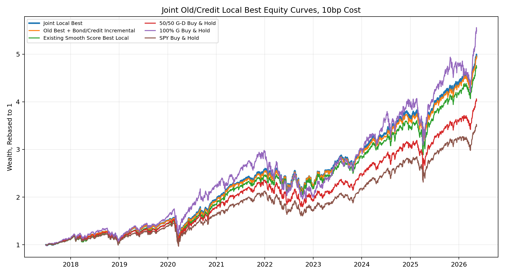
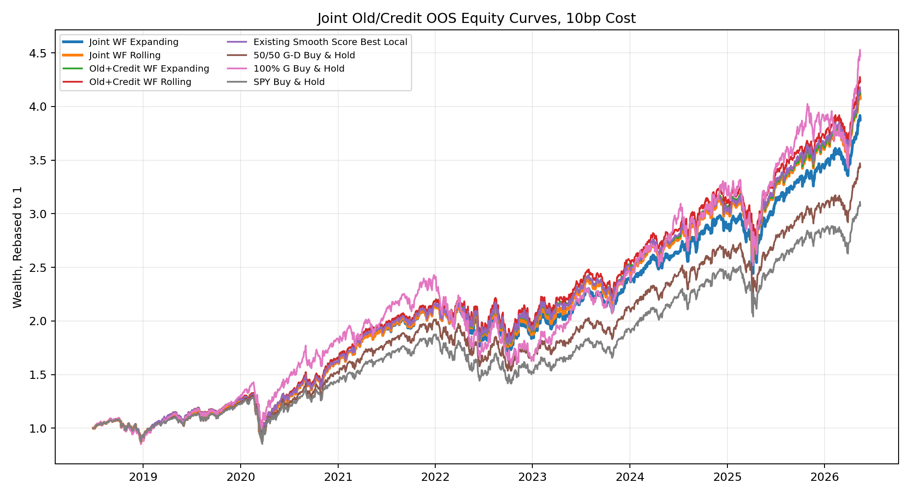

# Phase 1 Joint Old/Credit Policy v1 Report

This report tests a stricter joint-selection design. Unlike the previous `Old Best + Bond/Credit Incremental` experiment, the old score parameters are not fixed. The grid jointly selects the old smooth-score parameters and the bond/credit add-on parameters.

## 1. Score Definition

```text
score = alpha*r + (1-alpha)*d
      + lambda_stress*(0.5*z_old_i1 + 0.5*z_old_i2)
      - lambda_crowded*(0.5*z_old_i3 + 0.5*z_old_i4)
      + lambda_credit*ce
      + lambda_interaction*z(r*cs)
```

- `r`: rate relief, `-z(10Y yield 21d change)`.
- `d`: SPY drawdown depth, `-z(SPY drawdown)`.
- `ce`: credit relief, `-z(BAA10Y spread 21d change)`.
- `cs`: credit stress level, `z(BAA10Y spread)`.
- `old_i1`: rate relief x high VIX.
- `old_i2`: high VIX x VIX relief.
- `old_i3`: growth extension x low VIX.
- `old_i4`: growth extension x low VIX x rate quiet.

## 2. Parameter Grid

Total joint configurations tested: `1600`.

```text
alpha in {0.50, 0.67}
lambda_stress in {0.25, 0.50}
lambda_crowded in {0.05, 0.15}
lambda_credit in {0.00, 0.05, 0.10, 0.25, 0.50}
lambda_interaction in {0.00, 0.05, 0.10, 0.25, 0.50}
max_tilt in {0.30, 0.50}
tau_weight in {0.75, 1.00}
eta in {0.03, 0.05}
```

Selected local-best configuration:

| config_id | alpha | lambda_stress | lambda_crowded | lambda_credit | lambda_interaction | max_tilt | tau_weight | eta |
| --- | --- | --- | --- | --- | --- | --- | --- | --- |
| joint_a0.50_ls0.25_lcrowd0.05_lcred0.25_li0.50_tilt0.50_tau1.00_eta0.05 | 0.50 | 0.25 | 0.05 | 0.25 | 0.50 | 0.50 | 1.00 | 0.05 |

Top 10 local configurations at 10bp:

| config_id | cagr | ann_vol | sharpe | max_drawdown | calmar | annual_turnover | avg_g_weight | selection_score |
| --- | --- | --- | --- | --- | --- | --- | --- | --- |
| joint_a0.50_ls0.25_lcrowd0.05_lcred0.25_li0.50_tilt0.50_tau1.00_eta0.05 | 19.89% | 19.20% | 1.04 | -31.95% | 0.62 | 370.17% | 46.46% | 0.81 |
| joint_a0.50_ls0.25_lcrowd0.05_lcred0.10_li0.50_tilt0.50_tau0.75_eta0.05 | 19.88% | 19.27% | 1.04 | -31.86% | 0.62 | 406.99% | 44.31% | 0.81 |
| joint_a0.50_ls0.50_lcrowd0.05_lcred0.25_li0.25_tilt0.50_tau0.75_eta0.05 | 19.86% | 19.09% | 1.04 | -31.84% | 0.62 | 421.56% | 44.19% | 0.80 |
| joint_a0.50_ls0.25_lcrowd0.05_lcred0.25_li0.50_tilt0.50_tau0.75_eta0.05 | 20.26% | 19.16% | 1.06 | -31.93% | 0.63 | 422.16% | 44.63% | 0.80 |
| joint_a0.50_ls0.50_lcrowd0.05_lcred0.10_li0.50_tilt0.50_tau0.75_eta0.05 | 19.80% | 19.14% | 1.04 | -31.92% | 0.62 | 410.23% | 43.72% | 0.80 |
| joint_a0.50_ls0.50_lcrowd0.05_lcred0.25_li0.50_tilt0.50_tau0.75_eta0.05 | 19.92% | 19.06% | 1.05 | -31.98% | 0.62 | 422.95% | 43.68% | 0.80 |
| joint_a0.50_ls0.25_lcrowd0.05_lcred0.25_li0.25_tilt0.50_tau0.75_eta0.05 | 20.03% | 19.20% | 1.05 | -31.74% | 0.63 | 470.13% | 45.49% | 0.80 |
| joint_a0.50_ls0.25_lcrowd0.05_lcred0.25_li0.25_tilt0.50_tau1.00_eta0.05 | 19.71% | 19.22% | 1.03 | -31.80% | 0.62 | 412.95% | 46.92% | 0.80 |
| joint_a0.50_ls0.50_lcrowd0.05_lcred0.05_li0.50_tilt0.50_tau0.75_eta0.05 | 19.70% | 19.16% | 1.03 | -31.90% | 0.62 | 407.25% | 43.73% | 0.80 |
| joint_a0.50_ls0.50_lcrowd0.05_lcred0.25_li0.10_tilt0.50_tau0.75_eta0.05 | 19.70% | 19.13% | 1.04 | -31.80% | 0.62 | 443.74% | 44.72% | 0.79 |

## 3. Local Best Comparison

| display_name | start_date | end_date | cagr | ann_vol | sharpe | max_drawdown | calmar | annual_turnover | avg_g_weight | final_wealth |
| --- | --- | --- | --- | --- | --- | --- | --- | --- | --- | --- |
| Joint Local Best | 2017-06-28 | 2026-05-15 | 19.89% | 19.20% | 1.04 | -31.95% | 0.62 | 370.17% | 46.46% | 4.99 |
| Old Best + Bond/Credit Incremental | 2017-06-28 | 2026-05-15 | 19.80% | 19.14% | 1.04 | -31.92% | 0.62 | 410.23% | 43.72% | 4.96 |
| Existing Smooth Score Best Local | 2017-06-28 | 2026-05-15 | 19.24% | 19.29% | 1.01 | -31.63% | 0.61 | 469.67% | 45.06% | 4.76 |
| 50/50 G-D Buy & Hold | 2017-06-28 | 2026-05-15 | 17.12% | 19.34% | 0.91 | -33.59% | 0.51 | 0.00% | 50.00% | 4.06 |
| 100% G Buy & Hold | 2017-06-28 | 2026-05-15 | 21.34% | 23.53% | 0.94 | -34.35% | 0.62 | 0.00% | 100.00% | 5.55 |
| SPY Buy & Hold | 2017-06-28 | 2026-05-15 | 15.25% | 18.74% | 0.85 | -33.72% | 0.45 | 0.00% |  | 3.52 |

Incremental comparisons:

| comparison | annualized_excess_return | max_dd_diff | sharpe_diff | turnover_diff |
| --- | --- | --- | --- | --- |
| Joint Local Best - Old Best + Bond/Credit Incremental | 0.09% | -0.03% | 0.00 | -40.06% |
| Joint Local Best - Existing Smooth Score Best Local | 0.65% | -0.31% | 0.03 | -99.50% |
| Joint Local Best - 50/50 G-D Buy & Hold | 2.77% | 1.64% | 0.13 | 370.17% |
| Joint Local Best - 100% G Buy & Hold | -1.45% | 2.40% | 0.10 | 370.17% |
| Joint Local Best - SPY Buy & Hold | 4.65% | 1.77% | 0.19 | 370.17% |



## 4. OOS Validation: Expanding and Rolling

| display_name | start_date | end_date | cagr | ann_vol | sharpe | max_drawdown | calmar | annual_turnover | avg_g_weight | final_wealth |
| --- | --- | --- | --- | --- | --- | --- | --- | --- | --- | --- |
| Joint WF Expanding | 2018-06-28 | 2026-05-15 | 18.93% | 19.62% | 0.98 | -33.25% | 0.57 | 280.43% | 42.77% | 3.91 |
| Joint WF Rolling | 2018-06-28 | 2026-05-15 | 19.69% | 19.59% | 1.02 | -33.25% | 0.59 | 301.39% | 43.91% | 4.11 |
| Old+Credit WF Expanding | 2018-06-28 | 2026-05-15 | 19.83% | 19.74% | 1.02 | -32.36% | 0.61 | 388.44% | 43.26% | 4.15 |
| Old+Credit WF Rolling | 2018-06-28 | 2026-05-15 | 20.24% | 19.76% | 1.03 | -32.36% | 0.63 | 403.31% | 43.11% | 4.26 |
| Existing Smooth Score Best Local | 2018-06-28 | 2026-05-15 | 19.93% | 19.92% | 1.01 | -31.63% | 0.63 | 449.41% | 44.35% | 4.17 |
| 50/50 G-D Buy & Hold | 2018-06-28 | 2026-05-15 | 17.10% | 20.00% | 0.89 | -33.59% | 0.51 | 0.00% | 50.00% | 3.46 |
| 100% G Buy & Hold | 2018-06-28 | 2026-05-15 | 21.13% | 24.38% | 0.91 | -34.35% | 0.62 | 0.00% | 100.00% | 4.51 |
| SPY Buy & Hold | 2018-06-28 | 2026-05-15 | 15.45% | 19.39% | 0.84 | -33.72% | 0.46 | 0.00% |  | 3.09 |



OOS incremental comparisons:

| comparison | annualized_excess_return | max_dd_diff | sharpe_diff | turnover_diff |
| --- | --- | --- | --- | --- |
| Joint WF Expanding - Old+Credit WF Expanding | -0.90% | -0.89% | -0.03 | -108.01% |
| Joint WF Rolling - Old+Credit WF Rolling | -0.55% | -0.89% | -0.02 | -101.92% |
| Joint WF Rolling - Existing Smooth Score Best Local | -0.24% | -1.62% | 0.00 | -148.02% |
| Joint WF Rolling - 50/50 G-D Buy & Hold | 2.59% | 0.34% | 0.13 | 301.39% |
| Joint WF Rolling - 100% G Buy & Hold | -1.44% | 1.09% | 0.11 | 301.39% |

## 5. Walk-Forward Selection Frequency

| mode | selected_config_id | n_blocks |
| --- | --- | --- |
| expanding | joint_a0.50_ls0.50_lcrowd0.05_lcred0.25_li0.50_tilt0.50_tau1.00_eta0.05 | 8 |
| expanding | joint_a0.50_ls0.25_lcrowd0.05_lcred0.25_li0.50_tilt0.50_tau1.00_eta0.05 | 8 |
| expanding | joint_a0.50_ls0.50_lcrowd0.05_lcred0.25_li0.25_tilt0.50_tau0.75_eta0.05 | 6 |
| expanding | joint_a0.50_ls0.25_lcrowd0.05_lcred0.50_li0.50_tilt0.30_tau1.00_eta0.03 | 5 |
| expanding | joint_a0.50_ls0.50_lcrowd0.05_lcred0.10_li0.50_tilt0.30_tau1.00_eta0.03 | 2 |
| expanding | joint_a0.67_ls0.50_lcrowd0.05_lcred0.25_li0.50_tilt0.50_tau0.75_eta0.05 | 2 |
| expanding | joint_a0.50_ls0.25_lcrowd0.05_lcred0.25_li0.25_tilt0.50_tau1.00_eta0.05 | 1 |
| rolling | joint_a0.50_ls0.25_lcrowd0.05_lcred0.25_li0.25_tilt0.50_tau0.75_eta0.03 | 7 |
| rolling | joint_a0.50_ls0.25_lcrowd0.05_lcred0.50_li0.50_tilt0.30_tau1.00_eta0.03 | 5 |
| rolling | joint_a0.50_ls0.25_lcrowd0.05_lcred0.25_li0.10_tilt0.50_tau1.00_eta0.05 | 4 |
| rolling | joint_a0.67_ls0.25_lcrowd0.05_lcred0.25_li0.25_tilt0.50_tau1.00_eta0.05 | 3 |
| rolling | joint_a0.50_ls0.50_lcrowd0.05_lcred0.10_li0.50_tilt0.30_tau1.00_eta0.03 | 2 |
| rolling | joint_a0.50_ls0.50_lcrowd0.05_lcred0.25_li0.50_tilt0.50_tau1.00_eta0.05 | 2 |
| rolling | joint_a0.50_ls0.25_lcrowd0.05_lcred0.25_li0.50_tilt0.50_tau1.00_eta0.05 | 2 |
| rolling | joint_a0.50_ls0.25_lcrowd0.05_lcred0.25_li0.10_tilt0.50_tau0.75_eta0.03 | 2 |
| rolling | joint_a0.50_ls0.25_lcrowd0.05_lcred0.25_li0.50_tilt0.50_tau1.00_eta0.03 | 2 |
| rolling | joint_a0.67_ls0.25_lcrowd0.05_lcred0.25_li0.50_tilt0.50_tau0.75_eta0.05 | 1 |
| rolling | joint_a0.50_ls0.25_lcrowd0.05_lcred0.25_li0.50_tilt0.30_tau0.75_eta0.03 | 1 |
| rolling | joint_a0.50_ls0.25_lcrowd0.05_lcred0.10_li0.50_tilt0.30_tau0.75_eta0.03 | 1 |

## 6. Interpretation

This branch answers whether the credit extension should be treated as a small overlay to the old Best Local score or whether the full old/credit score should be jointly reselected. The local-best result shows that joint selection can slightly improve the in-sample/local objective and reduce turnover versus the fixed old-plus-credit overlay. However, the OOS results are stricter: the jointly selected expanding and rolling policies do not clearly dominate the prior fixed Old+Credit walk-forward policies. The current evidence therefore favors keeping the old Best structure plus credit overlay as the simpler and more robust implementation, while treating joint selection as a useful robustness check rather than the new mainline.
