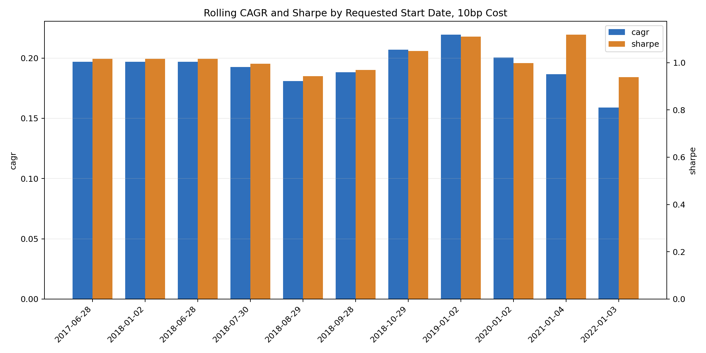
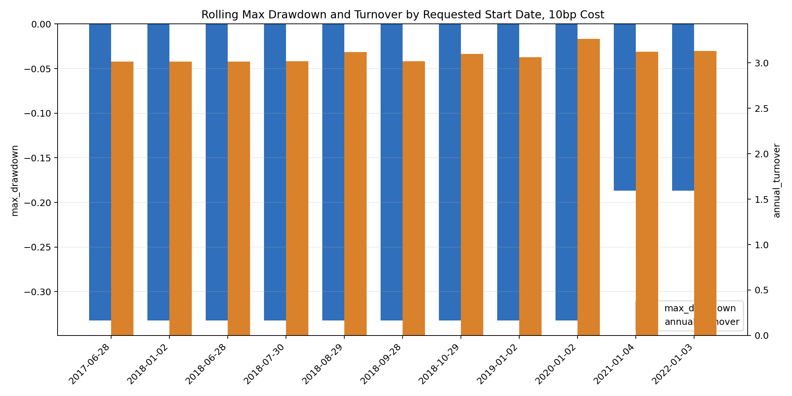
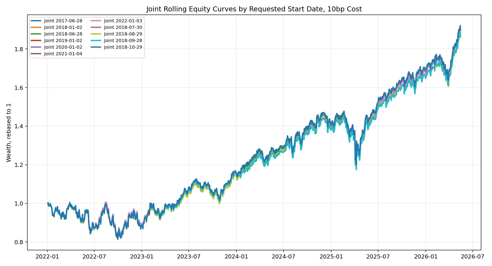
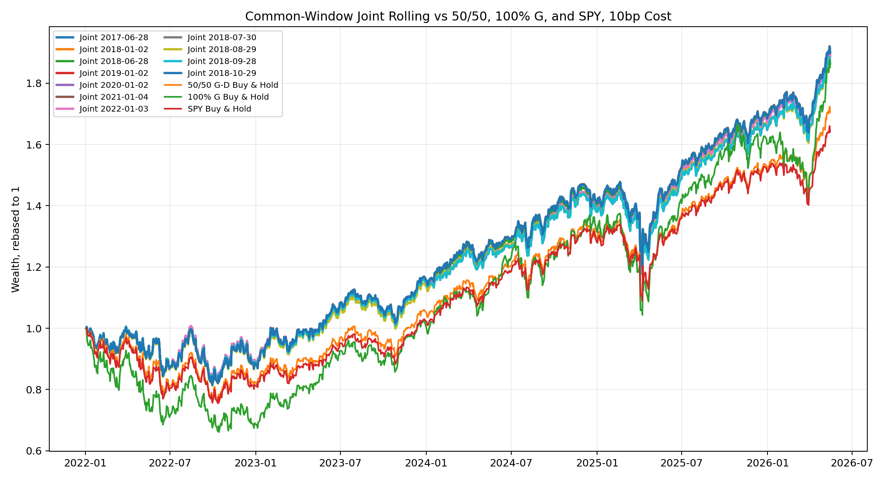

# Rolling Start-Date Sensitivity v1

This report tests whether the current Joint Old/Credit rolling validation is sensitive to the requested OOS start date and to 63-day block phase. The model, parameter grid, 756-day rolling training window, 63-day test block, 10bp transaction cost, and selection score are kept unchanged.

Important plot instruction: the common-window benchmark equity curve intentionally excludes `Old+Credit Rolling`; it compares only Joint Rolling start-date variants with 50/50 G-D, 100% G, and SPY.

## 1. Tested Start Dates

| start_group | requested_start_date |
| --- | --- |
| annual | 2017-06-28 |
| annual | 2018-01-02 |
| annual_block_phase_anchor | 2018-06-28 |
| annual | 2019-01-02 |
| annual | 2020-01-02 |
| annual | 2021-01-04 |
| annual | 2022-01-03 |
| block_phase | 2018-07-30 |
| block_phase | 2018-08-29 |
| block_phase | 2018-09-28 |
| block_phase | 2018-10-29 |

## 2. Start-to-End Joint Rolling Results

Each requested start date is run to the common dataset end. The `actual_start_date` can be later than the requested date when the rolling validation requires the initial training window.

| requested_start_date | actual_start_date | start_group | start_date | end_date | n_days | cagr | ann_vol | sharpe | max_drawdown | calmar | annual_turnover | avg_g_weight | final_wealth |
| --- | --- | --- | --- | --- | --- | --- | --- | --- | --- | --- | --- | --- | --- |
| 2017-06-28 | 2018-06-28 | annual | 2018-06-28 | 2026-05-15 | 1981 | 19.69% | 19.59% | 1.02 | -33.25% | 0.59 | 301.39% | 43.91% | 4.11 |
| 2018-01-02 | 2018-06-28 | annual | 2018-06-28 | 2026-05-15 | 1981 | 19.69% | 19.59% | 1.02 | -33.25% | 0.59 | 301.39% | 43.91% | 4.11 |
| 2018-06-28 | 2018-06-28 | annual_block_phase_anchor | 2018-06-28 | 2026-05-15 | 1981 | 19.69% | 19.59% | 1.02 | -33.25% | 0.59 | 301.39% | 43.91% | 4.11 |
| 2018-07-30 | 2018-07-30 | block_phase | 2018-07-30 | 2026-05-15 | 1960 | 19.26% | 19.65% | 1.00 | -33.25% | 0.58 | 301.81% | 43.93% | 3.94 |
| 2018-08-29 | 2018-08-29 | block_phase | 2018-08-29 | 2026-05-15 | 1938 | 18.10% | 19.71% | 0.94 | -33.25% | 0.54 | 311.74% | 42.43% | 3.59 |
| 2018-09-28 | 2018-09-28 | block_phase | 2018-09-28 | 2026-05-15 | 1917 | 18.83% | 19.84% | 0.97 | -33.25% | 0.57 | 301.88% | 43.27% | 3.72 |
| 2018-10-29 | 2018-10-29 | block_phase | 2018-10-29 | 2026-05-15 | 1896 | 20.69% | 19.80% | 1.05 | -33.25% | 0.62 | 309.79% | 43.75% | 4.12 |
| 2019-01-02 | 2019-01-02 | annual | 2019-01-02 | 2026-05-15 | 1853 | 21.95% | 19.63% | 1.11 | -33.25% | 0.66 | 306.11% | 42.97% | 4.30 |
| 2020-01-02 | 2020-01-02 | annual | 2020-01-02 | 2026-05-15 | 1601 | 20.03% | 20.38% | 1.00 | -33.25% | 0.60 | 326.37% | 40.00% | 3.19 |
| 2021-01-04 | 2021-01-04 | annual | 2021-01-04 | 2026-05-15 | 1348 | 18.65% | 16.51% | 1.12 | -18.69% | 1.00 | 312.06% | 38.06% | 2.50 |
| 2022-01-03 | 2022-01-03 | annual | 2022-01-03 | 2026-05-15 | 1096 | 15.89% | 17.29% | 0.94 | -18.69% | 0.85 | 312.80% | 39.28% | 1.90 |

## 3. Common-Window Results

Common window: `2022-01-03` to `2026-05-15`. All rolling start-date variants and benchmarks are evaluated on the same dates.

| display_name | requested_start_date | actual_start_date | start_date | end_date | n_days | cagr | ann_vol | sharpe | max_drawdown | calmar | annual_turnover | avg_g_weight | final_wealth |
| --- | --- | --- | --- | --- | --- | --- | --- | --- | --- | --- | --- | --- | --- |
| Joint Rolling 2017-06-28 | 2017-06-28 | 2018-06-28 | 2022-01-03 | 2026-05-15 | 1096 | 16.06% | 17.23% | 0.95 | -18.69% | 0.86 | 329.78% | 39.19% | 1.91 |
| Joint Rolling 2018-01-02 | 2018-01-02 | 2018-06-28 | 2022-01-03 | 2026-05-15 | 1096 | 16.06% | 17.23% | 0.95 | -18.69% | 0.86 | 329.78% | 39.19% | 1.91 |
| Joint Rolling 2018-06-28 | 2018-06-28 | 2018-06-28 | 2022-01-03 | 2026-05-15 | 1096 | 16.06% | 17.23% | 0.95 | -18.69% | 0.86 | 329.78% | 39.19% | 1.91 |
| Joint Rolling 2019-01-02 | 2019-01-02 | 2019-01-02 | 2022-01-03 | 2026-05-15 | 1096 | 15.55% | 17.19% | 0.93 | -18.69% | 0.83 | 323.45% | 38.42% | 1.88 |
| Joint Rolling 2020-01-02 | 2020-01-02 | 2020-01-02 | 2022-01-03 | 2026-05-15 | 1096 | 15.55% | 17.19% | 0.93 | -18.69% | 0.83 | 323.45% | 38.42% | 1.88 |
| Joint Rolling 2021-01-04 | 2021-01-04 | 2021-01-04 | 2022-01-03 | 2026-05-15 | 1096 | 15.89% | 17.29% | 0.94 | -18.69% | 0.85 | 312.80% | 39.28% | 1.90 |
| Joint Rolling 2022-01-03 | 2022-01-03 | 2022-01-03 | 2022-01-03 | 2026-05-15 | 1096 | 15.89% | 17.29% | 0.94 | -18.69% | 0.85 | 312.80% | 39.28% | 1.90 |
| Joint Rolling 2018-07-30 | 2018-07-30 | 2018-07-30 | 2022-01-03 | 2026-05-15 | 1096 | 16.08% | 17.27% | 0.95 | -18.72% | 0.86 | 327.43% | 39.97% | 1.91 |
| Joint Rolling 2018-08-29 | 2018-08-29 | 2018-08-29 | 2022-01-03 | 2026-05-15 | 1096 | 15.52% | 17.19% | 0.93 | -18.92% | 0.82 | 338.43% | 39.17% | 1.87 |
| Joint Rolling 2018-09-28 | 2018-09-28 | 2018-09-28 | 2022-01-03 | 2026-05-15 | 1096 | 15.57% | 17.18% | 0.93 | -18.71% | 0.83 | 318.64% | 38.47% | 1.88 |
| Joint Rolling 2018-10-29 | 2018-10-29 | 2018-10-29 | 2022-01-03 | 2026-05-15 | 1096 | 16.05% | 17.27% | 0.95 | -18.78% | 0.85 | 328.17% | 39.97% | 1.91 |
| 50/50 G-D Buy & Hold | benchmark | 2022-01-03 | 2022-01-03 | 2026-05-15 | 1096 | 13.23% | 18.02% | 0.78 | -23.78% | 0.56 | 0.00% | 50.00% | 1.72 |
| 100% G Buy & Hold | benchmark | 2022-01-03 | 2022-01-03 | 2026-05-15 | 1096 | 15.45% | 23.81% | 0.72 | -33.92% | 0.46 | 0.00% | 100.00% | 1.87 |
| SPY Buy & Hold | benchmark | 2022-01-03 | 2022-01-03 | 2026-05-15 | 1096 | 12.21% | 17.68% | 0.74 | -24.50% | 0.50 | 0.00% |  | 1.65 |

## 4. Fixed-Horizon Results

This table evaluates each start date over the first available 3-year or 5-year horizon when enough observations exist.

| horizon_years | requested_start_date | actual_start_date | start_date | end_date | n_days | cagr | ann_vol | sharpe | max_drawdown | calmar | annual_turnover | avg_g_weight | final_wealth |
| --- | --- | --- | --- | --- | --- | --- | --- | --- | --- | --- | --- | --- | --- |
| 3 | 2017-06-28 | 2018-06-28 | 2018-06-28 | 2021-06-29 | 756 | 24.68% | 23.44% | 1.06 | -33.25% | 0.74 | 257.08% | 51.79% | 1.94 |
| 3 | 2018-01-02 | 2018-06-28 | 2018-06-28 | 2021-06-29 | 756 | 24.68% | 23.44% | 1.06 | -33.25% | 0.74 | 257.08% | 51.79% | 1.94 |
| 3 | 2018-06-28 | 2018-06-28 | 2018-06-28 | 2021-06-29 | 756 | 24.68% | 23.44% | 1.06 | -33.25% | 0.74 | 257.08% | 51.79% | 1.94 |
| 3 | 2019-01-02 | 2019-01-02 | 2019-01-02 | 2021-12-30 | 756 | 31.96% | 22.70% | 1.34 | -33.25% | 0.96 | 280.93% | 49.58% | 2.30 |
| 3 | 2020-01-02 | 2020-01-02 | 2020-01-02 | 2022-12-30 | 756 | 15.06% | 25.22% | 0.68 | -33.25% | 0.45 | 412.63% | 42.07% | 1.52 |
| 3 | 2021-01-04 | 2021-01-04 | 2021-01-04 | 2024-01-04 | 756 | 14.67% | 17.41% | 0.87 | -18.22% | 0.81 | 405.70% | 39.80% | 1.51 |
| 3 | 2022-01-03 | 2022-01-03 | 2022-01-03 | 2025-01-06 | 756 | 12.13% | 17.22% | 0.75 | -18.22% | 0.67 | 362.29% | 38.06% | 1.41 |
| 3 | 2018-07-30 | 2018-07-30 | 2018-07-30 | 2021-07-29 | 756 | 24.04% | 23.38% | 1.04 | -33.25% | 0.72 | 260.44% | 50.98% | 1.91 |
| 3 | 2018-08-29 | 2018-08-29 | 2018-08-29 | 2021-08-30 | 756 | 22.18% | 23.40% | 0.97 | -33.25% | 0.67 | 271.00% | 48.51% | 1.82 |
| 3 | 2018-09-28 | 2018-09-28 | 2018-09-28 | 2021-09-29 | 756 | 22.23% | 23.54% | 0.97 | -33.25% | 0.67 | 276.52% | 51.50% | 1.83 |
| 3 | 2018-10-29 | 2018-10-29 | 2018-10-29 | 2021-10-28 | 756 | 27.35% | 23.22% | 1.16 | -33.25% | 0.82 | 282.54% | 49.98% | 2.07 |
| 5 | 2017-06-28 | 2018-06-28 | 2018-06-28 | 2023-06-30 | 1260 | 18.33% | 21.93% | 0.88 | -33.25% | 0.55 | 346.74% | 48.94% | 2.32 |
| 5 | 2018-01-02 | 2018-06-28 | 2018-06-28 | 2023-06-30 | 1260 | 18.33% | 21.93% | 0.88 | -33.25% | 0.55 | 346.74% | 48.94% | 2.32 |
| 5 | 2018-06-28 | 2018-06-28 | 2018-06-28 | 2023-06-30 | 1260 | 18.33% | 21.93% | 0.88 | -33.25% | 0.55 | 346.74% | 48.94% | 2.32 |
| 5 | 2019-01-02 | 2019-01-02 | 2019-01-02 | 2024-01-03 | 1260 | 21.30% | 21.39% | 1.01 | -33.25% | 0.64 | 356.16% | 46.54% | 2.63 |
| 5 | 2020-01-02 | 2020-01-02 | 2020-01-02 | 2025-01-03 | 1260 | 18.98% | 21.13% | 0.93 | -33.25% | 0.57 | 356.21% | 39.68% | 2.38 |
| 5 | 2021-01-04 | 2021-01-04 | 2021-01-04 | 2026-01-08 | 1260 | 17.53% | 16.75% | 1.05 | -18.69% | 0.94 | 319.96% | 37.95% | 2.24 |
| 5 | 2018-07-30 | 2018-07-30 | 2018-07-30 | 2023-08-01 | 1260 | 18.40% | 21.88% | 0.88 | -33.25% | 0.55 | 350.50% | 48.53% | 2.33 |
| 5 | 2018-08-29 | 2018-08-29 | 2018-08-29 | 2023-08-31 | 1260 | 15.94% | 21.87% | 0.79 | -33.25% | 0.48 | 365.43% | 46.08% | 2.09 |
| 5 | 2018-09-28 | 2018-09-28 | 2018-09-28 | 2023-10-02 | 1260 | 15.84% | 21.97% | 0.78 | -33.25% | 0.48 | 351.32% | 47.58% | 2.09 |
| 5 | 2018-10-29 | 2018-10-29 | 2018-10-29 | 2023-10-31 | 1260 | 17.50% | 21.78% | 0.85 | -33.25% | 0.53 | 355.23% | 46.98% | 2.24 |

## 5. Parameter Selection Stability

| requested_start_date | actual_start_date | start_group | n_blocks | unique_selected_configs | switch_count | most_frequent_config | most_frequent_blocks | most_frequent_share |
| --- | --- | --- | --- | --- | --- | --- | --- | --- |
| 2017-06-28 | 2018-06-28 | annual | 32 | 12 | 14 | joint_a0.50_ls0.25_lcrowd0.05_lcred0.25_li0.25_tilt0.50_tau0.75_eta0.03 | 7 | 21.88% |
| 2018-01-02 | 2018-06-28 | annual | 32 | 12 | 14 | joint_a0.50_ls0.25_lcrowd0.05_lcred0.25_li0.25_tilt0.50_tau0.75_eta0.03 | 7 | 21.88% |
| 2018-06-28 | 2018-06-28 | annual_block_phase_anchor | 32 | 12 | 14 | joint_a0.50_ls0.25_lcrowd0.05_lcred0.25_li0.25_tilt0.50_tau0.75_eta0.03 | 7 | 21.88% |
| 2019-01-02 | 2019-01-02 | annual | 30 | 14 | 17 | joint_a0.50_ls0.25_lcrowd0.05_lcred0.25_li0.25_tilt0.50_tau0.75_eta0.03 | 5 | 16.67% |
| 2020-01-02 | 2020-01-02 | annual | 26 | 13 | 15 | joint_a0.50_ls0.25_lcrowd0.05_lcred0.25_li0.25_tilt0.50_tau0.75_eta0.03 | 5 | 19.23% |
| 2021-01-04 | 2021-01-04 | annual | 22 | 12 | 13 | joint_a0.50_ls0.25_lcrowd0.05_lcred0.25_li0.25_tilt0.50_tau0.75_eta0.03 | 6 | 27.27% |
| 2022-01-03 | 2022-01-03 | annual | 18 | 10 | 10 | joint_a0.50_ls0.25_lcrowd0.05_lcred0.25_li0.25_tilt0.50_tau0.75_eta0.03 | 6 | 33.33% |
| 2018-07-30 | 2018-07-30 | block_phase | 32 | 14 | 20 | joint_a0.50_ls0.25_lcrowd0.05_lcred0.25_li0.25_tilt0.50_tau0.75_eta0.03 | 7 | 21.88% |
| 2018-08-29 | 2018-08-29 | block_phase | 31 | 16 | 21 | joint_a0.50_ls0.25_lcrowd0.05_lcred0.25_li0.25_tilt0.50_tau0.75_eta0.03 | 7 | 22.58% |
| 2018-09-28 | 2018-09-28 | block_phase | 31 | 15 | 19 | joint_a0.50_ls0.25_lcrowd0.05_lcred0.25_li0.25_tilt0.50_tau0.75_eta0.03 | 5 | 16.13% |
| 2018-10-29 | 2018-10-29 | block_phase | 31 | 15 | 21 | joint_a0.50_ls0.25_lcrowd0.05_lcred0.25_li0.25_tilt0.50_tau0.75_eta0.03 | 7 | 22.58% |

## 6. Interpretation

- Start-to-end CAGR ranges from `15.89%` to `21.95%` and Sharpe ranges from `0.94` to `1.12`. This range is partly driven by market-period inclusion: later starts exclude the COVID crash/rebound and shorten the sample.
- On the strict common window `2022-01-03` to `2026-05-15`, Joint Rolling variants are much tighter: CAGR ranges from `15.52%` to `16.08%`, Sharpe ranges from `0.93` to `0.95`, and max drawdown ranges from `-18.92%` to `-18.69%`.
- On the common window, the Joint Rolling variants are above 50/50 G-D buy-and-hold (`13.23%` CAGR, `0.78` Sharpe) and SPY (`12.21%` CAGR, `0.74` Sharpe). They are also slightly above 100% G on CAGR while carrying lower volatility and much smaller max drawdown.
- The block-phase tests around 2018 show some start-to-end dispersion, but the common-window results are close. This suggests the rolling result is not mainly an artifact of the original `2018-06-28` start date, although parameter selection itself remains path-dependent.
- The same most-frequent configuration appears across all start-date variants, but the number of unique selected configurations remains high. Therefore the strategy family is stable, while exact block-by-block parameter selection is not perfectly stable.
- The common-window figure intentionally excludes Old+Credit Rolling, following the requested plot scope.
